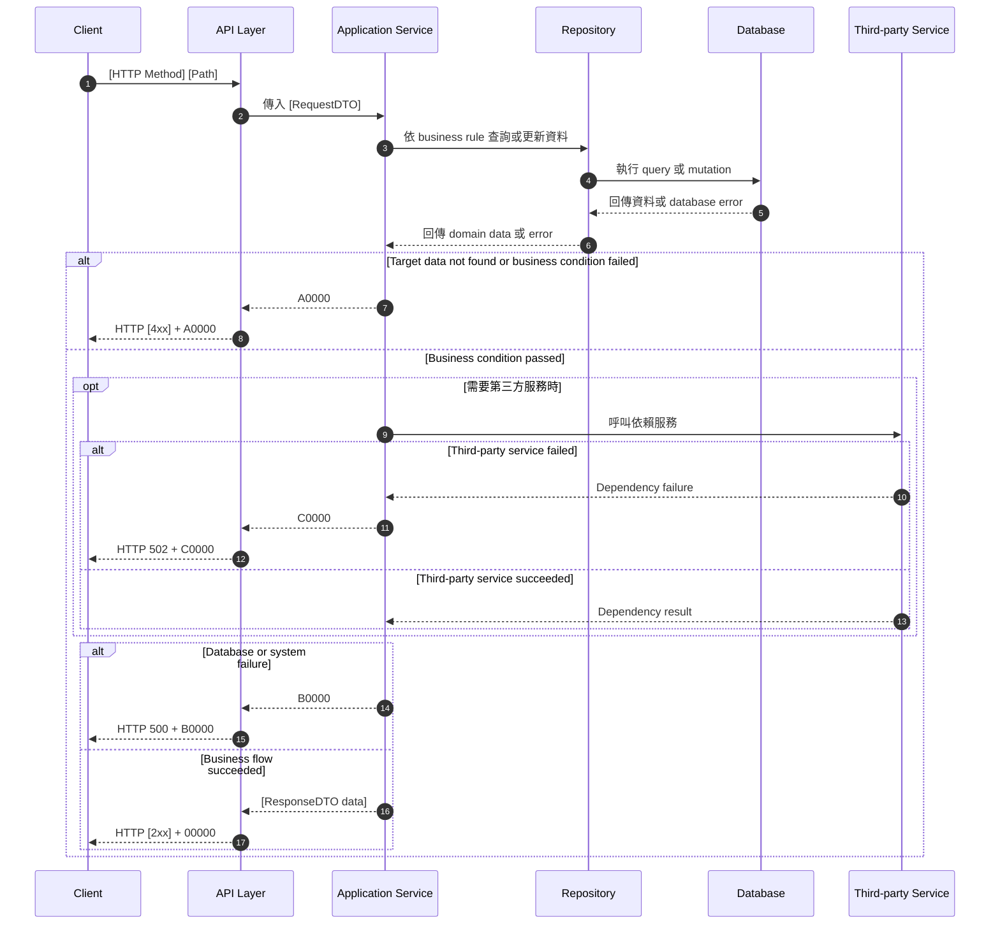

# API Flow Docs Template

> 每一個 API ID 使用一個 Markdown 檔案，檔名格式為
> `docs/api/{api_id}_{name}.md`。此文件只描述 application service 的
> business flow，不重複完整的 OpenAPI schema 或 OpenAPI Generator 已產生的
> request constraint。表格標題維持英文，說明內容使用中文。

## 1. 修改紀錄

每次修改都要記錄修改人、日期，以及修改原因與內容。

| Version | Who | When | Why / What |
| --- | --- | --- | --- |
| 1.0.0 | Codex / SD | 2026-08-31 | 建立 API Flow Docs reference template。 |
| [version] | [name or role] | [YYYY-MM-DD] | [填寫修改原因與具體變更內容] |

## 2. API Flow

### 2.1 Workflow Sequence Diagram

以下圖例只描述 application service 的 business logic、資料存取、第三方
依賴與 response result。OpenAPI Generator 已處理的 request constraint、型別
與格式驗證不放在此圖中。請依實際 API 替換 participant、business method、
repository method 與錯誤條件；沒有使用第三方服務時，移除 `ThirdParty` 與
對應的 `opt` 區塊。



## 3. Execute Business Logic

> 本章只保留 application service 的 business logic。不要在這裡重新描述
> request 欄位格式、required、min/max、pattern 或其他已由 OpenAPI contract
> 定義的 constraint。

### Detailed Logic

1. OpenAPI Generator 已完成 request constraint、型別與格式驗證；本文件不
   重複定義這些規則。
2. 依 requirement 定義的順序執行 business rules，說明必要的資料查詢、欄位
   轉換、狀態轉移、權限判斷與重複資料判斷。
3. 若找不到必要資料或 business condition 不成立，停止後續 mutation，依第
   4 章回傳對應的 business code。
4. 若流程涉及多筆資料，列出讀寫順序、transaction boundary 與必要的 lock
   行為。
5. 若需要呼叫第三方服務，說明 timeout、retry、idempotency，以及失敗時的
   rollback 或補償行為。
6. 說明成功結果如何交給 API layer 組成 OpenAPI 定義的 `[ResponseDTO]`，但
   不要在此重複完整 response schema。

### Given / When / Then

- Given OpenAPI Generator 已完成 request constraint 與 DTO mapping，且
  application service 已取得執行流程所需的資料
- When application service 執行本 API 的 business logic
- Then 依 business rules 產生成功結果或明確的 business error，並交由 API
  layer 依 OpenAPI contract 回傳

## 4. 錯誤代碼 (Error Codes)

### 4.1 Business Code Definition

全域 business code 定義以 `docs/error-codes.md` 為唯一來源。HTTP status
不能取代 business code，request constraint 的具體規則則只定義在
`docs/openapi.yaml`。本文件不重複定義 global code 的語意。

### 4.2 API-specific Error Mapping

只保留本 API 實際可能回傳的代碼；不要因為共用代碼表而虛構不存在的
第三方依賴或錯誤情境。每個 business code 的全域定義請參照
`docs/error-codes.md`。

| HTTP Status | Business Code | Trigger | Response Behavior | Retryable |
| --- | --- | --- | --- | --- |
| `[2xx]` | `00000` | API business flow 成功完成。 | 回傳 `[ResponseDTO]` 與成功訊息。 | 否 |
| `[400 / 401 / 403 / 404 / 409]` | `A0000` | 業務流程中的權限、資源不存在、狀態衝突或唯一性限制失敗；request constraint 詳細規則引用 OpenAPI。 | 回傳中文錯誤訊息、`traceId`，必要時附 field-level details。 | 否 |
| `500` | `B0000` | 內部程式、database 或不可預期錯誤。 | 對 client 隱藏內部細節；以 `traceId` 關聯 server log。 | 通常否 |
| `[502 / 503]` | `C0000` | 第三方服務錯誤或 timeout；僅在本 API 確實依賴第三方時使用。 | 回傳可安全揭露的依賴服務錯誤訊息。 | `[依 retry policy]` |

### 4.3 Error Response Example

錯誤 response 的欄位需與 `docs/openapi.yaml` 中的 `ErrorResponseDTO` 一致。

```json
{
  "code": "A0000",
  "message": "[中文錯誤訊息]",
  "traceId": "[trace-id]",
  "details": [
    {
      "field": "[fieldName]",
      "reason": "[中文欄位錯誤原因]"
    }
  ]
}
```
