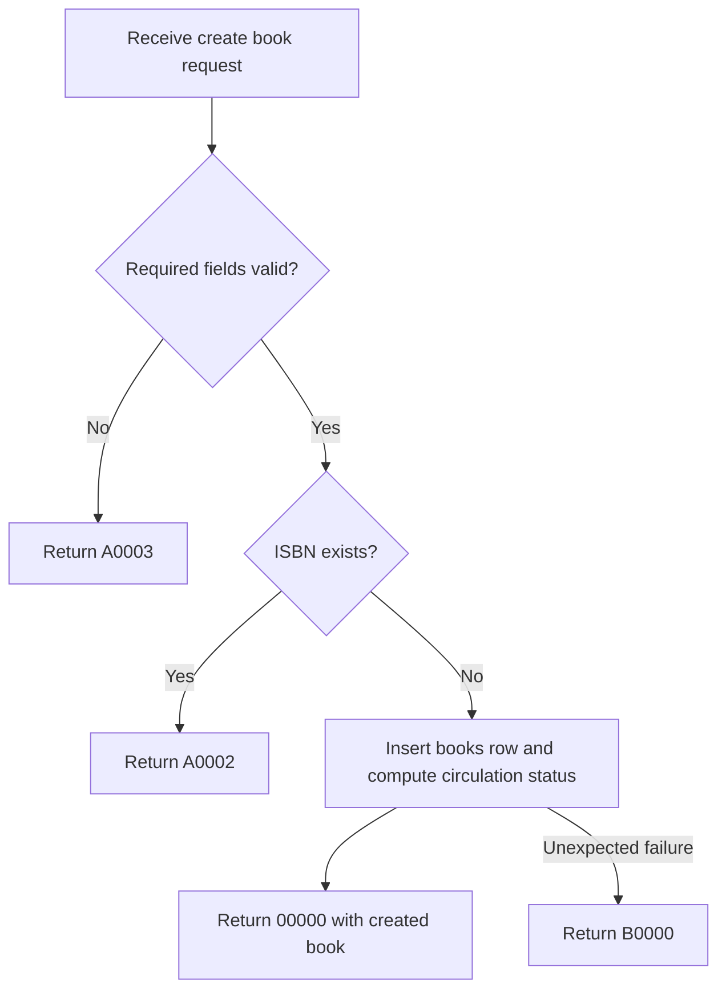

# API Flow: library-books-001 Create Book

- API ID: `library-books-001`
- Path: `POST /library/books`

## Main Flow

## Given/When/Then Rules

1. Given valid `title`, unique `isbn`, valid `quantity`, and valid `shelfStatus`
   When `POST /library/books` is called
   Then create book inventory and return `00000` with created book data.

2. Given existing `isbn`
   When `POST /library/books` is called with same `isbn`
   Then reject creation and return `A0002`.

3. Given missing required fields or invalid format
   When `POST /library/books` is called
   Then reject request and return `A0003`.

4. Given DB write fails unexpectedly
   When create book transaction executes
   Then rollback and return `B0000`.
