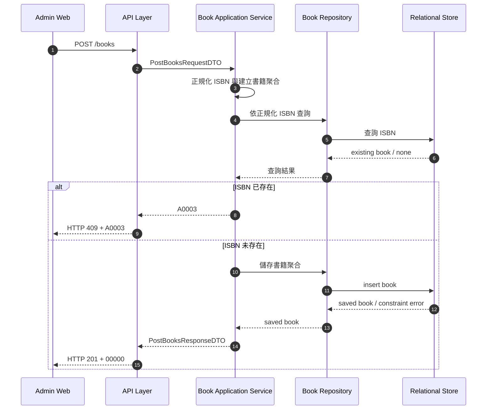

# `library-books-001`｜建立書籍 API Flow

## 1. 修改紀錄

| Version | Who | When | Why / What |
| --- | --- | --- | --- |
| 1.0.0 | Codex / SD | 2026-09-01 | 依 REQ-LIB-001 與 OpenAPI 建立建立書籍的 application service flow。 |

## 2. API Flow

- API ID：`library-books-001`
- OpenAPI operation：`POST /books`（`operationId: postBooks`）
- Contract source：[`docs/openapi.yaml`](../openapi.yaml)

### 2.1 Workflow Sequence Diagram

```mermaid
sequenceDiagram
    autonumber
    participant Client as Admin Web
    participant API as API Layer
    participant Service as Book Application Service
    participant Repository as Book Repository
    participant Database as Relational Store

    Client->>API: POST /books
    API->>Service: PostBooksRequestDTO
    Service->>Service: 正規化 ISBN 與建立書籍聚合
    Service->>Repository: 依正規化 ISBN 查詢
    Repository->>Database: 查詢 ISBN
    Database-->>Repository: existing book / none
    Repository-->>Service: 查詢結果
    alt ISBN 已存在
        Service-->>API: A0003
        API-->>Client: HTTP 409 + A0003
    else ISBN 未存在
        Service->>Repository: 儲存書籍聚合
        Repository->>Database: insert book
        Database-->>Repository: saved book / constraint error
        Repository-->>Service: saved book
        Service-->>API: PostBooksResponseDTO
        API-->>Client: HTTP 201 + 00000
    end
```

## 3. Execute Business Logic

OpenAPI 已處理 request constraint、型別與格式驗證；本文件不重複定義欄位限制。

### Detailed Logic

1. 將輸入 ISBN 轉為 canonical form（移除連字號、將 `x` 轉為 `X`），後續唯一性判斷只使用 canonical form。
2. 檢查 canonical ISBN 是否已存在；存在時不執行 mutation，回傳 `A0003`。
3. 建立書籍聚合：`availableCount` 初始等於 `totalCount`；依 `isActive` 設定 `available` 或 `inactive` 狀態。
4. 在同一 persistence boundary 寫入書籍。若唯一約束在競爭請求中被觸發，轉為 `A0003`，不可暴露資料庫錯誤。
5. 成功後由 API layer 組成 OpenAPI 定義的 `PostBooksResponseDTO`，回傳新書籍資料與 `00000`。

### Given / When / Then

- Given canonical ISBN 尚未存在且 request 已通過 OpenAPI constraint
- When application service 建立書籍
- Then 新書籍的可借數等於總數，依上架狀態設定 status，並回傳 `PostBooksResponseDTO` 與 `00000`

- Given canonical ISBN 已存在
- When application service 嘗試建立書籍
- Then 不新增資料，回傳 `A0003` 與可理解的繁體中文訊息

## 4. 錯誤代碼 (Error Codes)

全域定義請參照 [`docs/error-codes.md`](../error-codes.md)。

| HTTP Status | Business Code | Trigger | Response Behavior | Retryable |
| --- | --- | --- | --- | --- |
| `201` | `00000` | 書籍成功建立。 | 回傳新書籍資料、成功訊息與 `traceId`。 | 否 |
| `400` | `A0001` | OpenAPI request constraint 未通過。 | 回傳欄位細節；不寫入資料。 | 否 |
| `409` | `A0003` | ISBN 已存在或競爭請求觸發唯一性衝突。 | 回傳重複 ISBN 訊息；不寫入第二筆。 | 否 |
| `500` | `B0000` | 非預期 API／Store 錯誤。 | 隱藏內部細節，以 `traceId` 關聯 log。 | 通常否 |
| `500` | `B0001` | 寫入後的資料完整性檢查失敗。 | 不回傳成功資料，要求重新載入。 | 僅確認未提交後可重試 |
