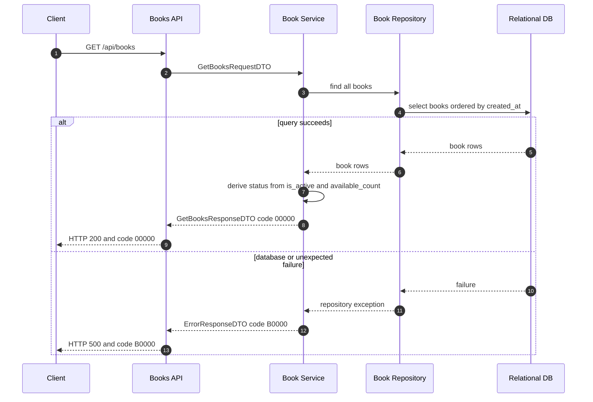

# library-books-001 取得館藏列表 API Flow

## 1. 修改紀錄

| Version | Who | When | Why / What |
| --- | --- | --- | --- |
| 1.0.0 | SD | 2026-09-04 | 定義館藏列表查詢的 service、repository 與業務錯誤流程。 |

## 2. API Flow

- API ID: `library-books-001`
- HTTP Method: `GET`
- Path: `/api/books`
- OpenAPI operationId: `getBooks`
- Request DTO: `GetBooksRequestDTO`
- Response DTO: `GetBooksResponseDTO`
- Contract source: `docs/openapi.yaml`
- Authentication context: test-only default Admin; no login or authorization check is performed.

### 2.1 Workflow Sequence Diagram

## 3. Execute Business Logic

### Detailed Logic

1. API layer creates an empty `GetBooksRequestDTO`; this MVP has no search or pagination parameters.
2. Service reads all rows from `books` through the repository using a deterministic order.
3. Service maps each row to `BookDTO`; `status` is derived as `INACTIVE` when `is_active` is false, `BORROWED` when `available_count` is zero, otherwise `AVAILABLE`.
4. An empty result is valid and returns an empty `data` array with business code `00000`.
5. The response includes a `traceId`. A persistence or unexpected application failure returns `B0000` and must not be reported as success.

### Given / When / Then

- Given the test environment is entered as the default Admin and the database is available.
- When the client sends `GET /api/books`.
- Then the API returns HTTP 200, `GetBooksResponseDTO`, and code `00000`.
- Given no book rows exist, When the client sends `GET /api/books`, Then the API returns code `00000` with an empty list rather than `A0000`.
- Given a row has `is_active = false`, When the list is mapped, Then its response status is `INACTIVE` regardless of available count.
- Given the repository or database fails, When the query completes, Then the API returns HTTP 500 with `ErrorResponseDTO` code `B0000` and a `traceId`.

## 4. 錯誤代碼 (Error Codes)

本 API 遵循 [`docs/error-codes.md`](../error-codes.md) 的業務錯誤碼與 HTTP status 規則。

### 4.2 API-specific Error Mapping

| HTTP status | Business code | Condition | Client behavior |
| --- | --- | --- | --- |
| 200 | `00000` | Query succeeds, including an empty result. | Render the returned list. |
| 500 | `B0000` | Database or unexpected internal failure. | Show a generic failure and retain `traceId`; do not treat the list as current. |
