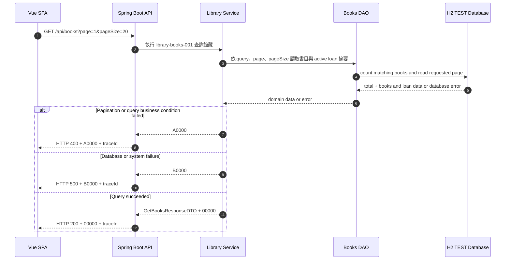

# library-books-001 查詢館藏 API Flow

## 1. 修改紀錄

| Version | Who | When | Why / What |
| --- | --- | --- | --- |
| 1.0.0 | Codex / SD | 2026-09-08 | 建立 TEST MVP 館藏查詢與搜尋流程。 |
| 1.1.0 | Codex / SD | 2026-09-08 | 新增 1-based page-number 分頁契約與回應 metadata。 |

## 2. API Flow

### 2.1 Workflow Sequence Diagram

CORS: ignored for test to accelerate development。此決策只適用 TEST，不得推廣為 production policy。

## 3. Execute Business Logic

### Detailed Logic

1. OpenAPI Generator 已處理 query、page、pageSize constraint 與 DTO mapping；本文件不重複定義欄位格式。
2. Service 以目前館藏 snapshot 查詢書目，query 未提供時回傳全部書目；提供時依書名、ISBN 或作者執行不分大小寫的包含搜尋。
3. 未提供分頁參數時使用 `page=1`、`pageSize=20`；page 從 1 開始，pageSize 最大為 100。
4. 以 `updatedAt DESC, bookId ASC` 穩定排序後執行分頁，Repository 在同一查詢 snapshot 取得符合條件的 `total` 與指定頁資料。
5. Service 計算 `totalPages=ceil(total/pageSize)`；`total=0` 時 `totalPages=0`。
6. 若 `page > max(1,totalPages)`，視為無效分頁條件，回傳 `A0000`；因此空結果僅允許請求 `page=1`，且不修改資料。
7. Service 讀取每筆當頁書目的目前可借數、總數、status，並提供 active loan 摘要，使前端能從館藏列表導向唯一的歸還紀錄。
8. 查詢不使用 cache，確保借出／歸還後的列表具備 read-after-write freshness。
9. 查詢成功交給 API layer 組成含分頁 metadata 的 `GetBooksResponseDTO` 並帶 `00000`；不可將空結果誤判為 system error。
10. query 或 pagination business condition 不成立時停止查詢結果組裝並回傳 `A0000`；H2 或其他內部錯誤回傳 `B0000`。

### Given / When / Then

- Given OpenAPI constraint 已通過，TEST API 可連線且 H2 可讀取
- When application service 執行 `library-books-001` 並接收可選 query、page、pageSize
- Then 回傳指定頁館藏、分頁 metadata、數量、狀態與必要的 active loan 摘要，成功時 business code 為 `00000`
- Given query 或 pagination 條件不符合 contract，或 page 超出可用頁數
- When application service 執行查詢
- Then 回傳 `A0000` 且不產生任何 mutation
- Given H2 讀取失敗
- When application service 執行查詢
- Then 回傳 `B0000`，且不產生任何 mutation

## 4. 錯誤代碼 (Error Codes)

### 4.1 Business Code Definition

全域 business code 定義以 [`docs/error-codes.md`](../error-codes.md) 為唯一來源。HTTP status 不能取代 business code，request constraint 的具體規則只定義在 [`docs/openapi.yaml`](../openapi.yaml)。

### 4.2 API-specific Error Mapping

| HTTP Status | Business Code | Trigger | Response Behavior | Retryable |
| --- | --- | --- | --- | --- |
| `200` | `00000` | 館藏查詢成功，包含空結果。 | 回傳 `GetBooksResponseDTO` 與 `traceId`。 | 否 |
| `400` | `A0000` | query 或 pagination business condition 不符合 contract，或 page 超出可用頁數。 | 回傳錯誤訊息與 `traceId`，不修改資料。 | 否 |
| `500` | `B0000` | H2、API 或未預期的內部錯誤。 | 隱藏內部細節，回傳 `traceId` 供 log 查找。 | 是，僅在 client 尚未收到結果時 |

TEST 無 runtime third-party dependency，因此本 API 不使用 `C0000`。
