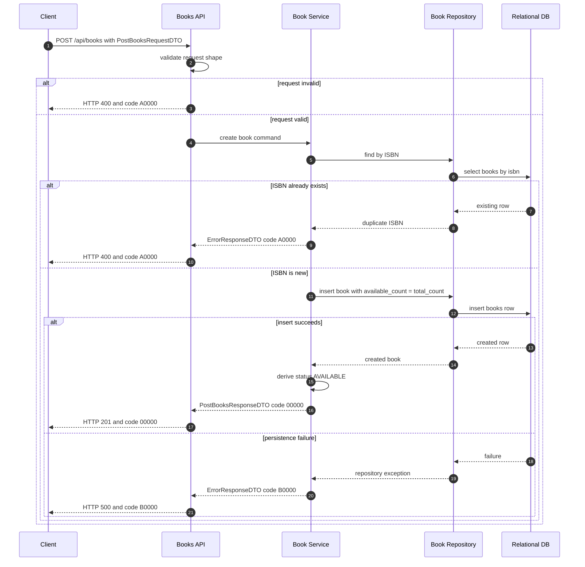

# library-books-002 建立書籍與初始館藏 API Flow

## 1. 修改紀錄

| Version | Who | When | Why / What |
| --- | --- | --- | --- |
| 1.0.0 | SD | 2026-09-04 | 定義建立書籍、唯一 ISBN 檢查與初始館藏數量流程。 |

## 2. API Flow

- API ID: `library-books-002`
- HTTP Method: `POST`
- Path: `/api/books`
- OpenAPI operationId: `postBooks`
- Request DTO: `PostBooksRequestDTO`
- Response DTO: `PostBooksResponseDTO`
- Contract source: `docs/openapi.yaml`
- Authentication context: test-only default Admin; no login or authorization check is performed.

### 2.1 Workflow Sequence Diagram

## 3. Execute Business Logic

### Detailed Logic

1. API layer validates the request against `PostBooksRequestDTO` in `docs/openapi.yaml`.
2. Service checks whether the submitted ISBN already exists in `books`.
3. For a new ISBN, service generates `book_id`, sets `total_count` from `quantity`, and initializes `available_count` to the same value.
4. `isActive` defaults to true when omitted. The returned `BookDTO.status` is derived from the persisted active flag and available count.
5. The insert and initial inventory values are one business operation. Unique or validation failures map to `A0000`; persistence failures map to `B0000`.

### Given / When / Then

- Given a valid title, unique ISBN, category, and quantity greater than zero.
- When the client sends `POST /api/books`.
- Then the API creates one book and returns HTTP 201 with code `00000`.
- Given `isActive` is omitted, When the book is created, Then the persisted value is true and the response status is `AVAILABLE` when quantity is positive.
- Given the ISBN already exists, When the client sends the create request, Then the API returns HTTP 400 with `ErrorResponseDTO` code `A0000` and does not create a second row.
- Given request validation fails or quantity is invalid, When the request reaches the API, Then the API returns HTTP 400 with code `A0000`.
- Given the database insert fails, When the create operation completes, Then the API returns HTTP 500 with code `B0000` and includes a `traceId`.

## 4. 錯誤代碼 (Error Codes)

本 API 遵循 [`docs/error-codes.md`](../error-codes.md) 的業務錯誤碼與 HTTP status 規則。

### 4.2 API-specific Error Mapping

| HTTP status | Business code | Condition | Client behavior |
| --- | --- | --- | --- |
| 201 | `00000` | New book and initial inventory are persisted. | Add the returned book to the catalogue. |
| 400 | `A0000` | Invalid input or duplicate ISBN. | Show the correction message and do not retry unchanged. |
| 500 | `B0000` | Database or unexpected internal failure. | Show a generic failure and retain `traceId`. |
