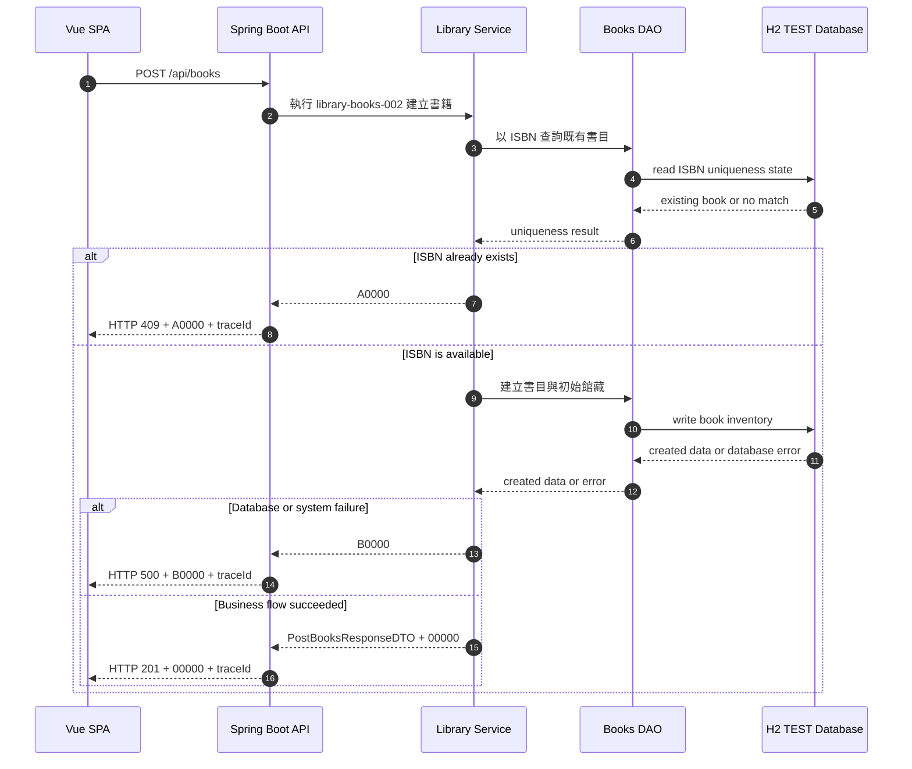

# library-books-002 建立書籍 API Flow

## 1. 修改紀錄

| Version | Who | When | Why / What |
| --- | --- | --- | --- |
| 1.0.0 | Codex / SD | 2026-09-08 | 建立 TEST MVP 書籍與初始館藏建立流程。 |

## 2. API Flow

### 2.1 Workflow Sequence Diagram

CORS: ignored for test to accelerate development。此決策只適用 TEST，不得推廣為 production policy。

## 3. Execute Business Logic

### Detailed Logic

1. OpenAPI Generator 已處理 request constraint、型別與格式驗證；本文件不重複定義欄位規則。
2. Service 依 ISBN 判斷書目是否已存在；若存在，停止 mutation 並回傳 `A0000`。
3. 若 ISBN 可用，Service 建立書目，將 total count 與 available count 設為初始數量，並依上架值決定 `AVAILABLE` 或 `INACTIVE` 狀態。
4. 建立書目與初始館藏必須在同一 H2 persistence boundary 完成；若寫入失敗，API 不可回傳成功結果。
5. 成功結果交給 API layer 組成 `PostBooksResponseDTO` 並帶 `00000`；API 不直接暴露 database constraint exception。
6. Idempotency-Key 相同且已有已確認結果時，Service 回傳相同 business result，不建立第二筆書目；衝突情況依本 API error mapping 處理。

### Given / When / Then

- Given OpenAPI constraint 已通過，且 ISBN 在 TEST 館藏中不存在
- When application service 執行 `library-books-002`
- Then 建立一筆書目與初始館藏，成功回傳 `PostBooksResponseDTO` 與 `00000`
- Given ISBN 已存在或 H2 mutation 失敗
- When application service 執行建立書籍
- Then 回傳 `A0000` 或 `B0000`，且不可留下部分建立結果

## 4. 錯誤代碼 (Error Codes)

### 4.1 Business Code Definition

全域 business code 定義以 [`docs/error-codes.md`](../error-codes.md) 為唯一來源。HTTP status 不能取代 business code，request constraint 的具體規則只定義在 [`docs/openapi.yaml`](../openapi.yaml)。

### 4.2 API-specific Error Mapping

| HTTP Status | Business Code | Trigger | Response Behavior | Retryable |
| --- | --- | --- | --- | --- |
| `201` | `00000` | 書目與初始館藏建立成功。 | 回傳 `PostBooksResponseDTO` 與 `traceId`。 | 否 |
| `400` | `A0000` | 書籍欄位、分類或數量不符合 OpenAPI contract。 | 回傳欄位 details 與 `traceId`，不建立資料。 | 否 |
| `409` | `A0000` | ISBN 已存在或相同 idempotency key 對應到不相容 request。 | 回傳衝突訊息與 `traceId`，保留既有資料。 | 否，修正後可重試 |
| `500` | `B0000` | H2 寫入或內部服務發生未預期錯誤。 | 隱藏內部細節，回傳 `traceId`。 | 僅在結果未確認時 |

TEST 無 runtime third-party dependency，因此本 API 不使用 `C0000`。
