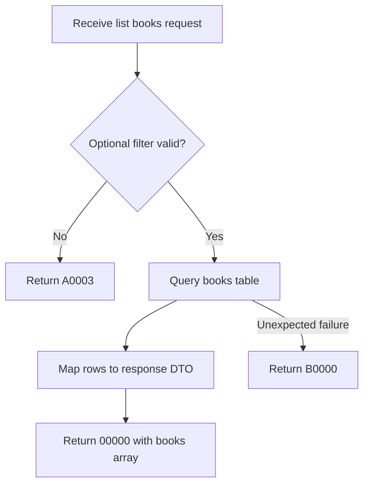

# API Flow: library-books-002 List Books

- API ID: `library-books-002`
- Path: `GET /library/books`

## Main Flow

## Given/When/Then Rules

1. Given no filter or valid `shelfStatus` filter
   When `GET /library/books` is called
   Then return `00000` with current book list.

2. Given invalid query format
   When `GET /library/books` is called
   Then return `A0003`.

3. Given database query failure
   When list operation executes
   Then return `B0000`.
