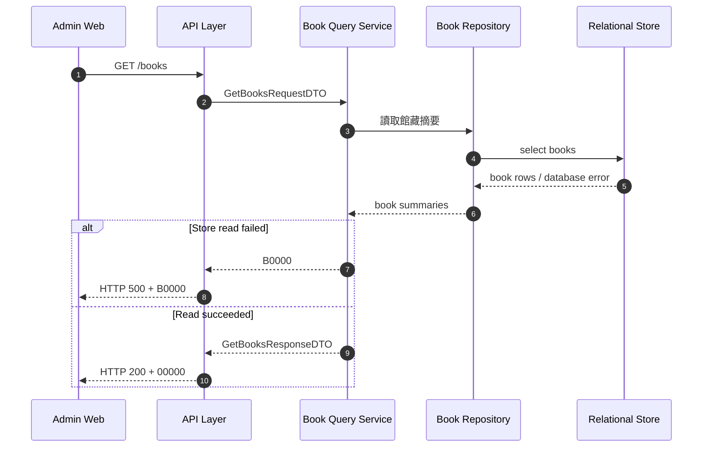

# `library-books-002`｜取得館藏列表 API Flow

## 1. 修改紀錄

| Version | Who | When | Why / What |
| --- | --- | --- | --- |
| 1.0.0 | Codex / SD | 2026-09-01 | 依 REQ-LIB-001 與 OpenAPI 建立館藏列表查詢 flow。 |

## 2. API Flow

- API ID：`library-books-002`
- OpenAPI operation：`GET /books`（`operationId: getBooks`）
- Contract source：[`docs/openapi.yaml`](../openapi.yaml)

### 2.1 Workflow Sequence Diagram

```mermaid
sequenceDiagram
    autonumber
    participant Client as Admin Web
    participant API as API Layer
    participant Service as Book Query Service
    participant Repository as Book Repository
    participant Database as Relational Store

    Client->>API: GET /books
    API->>Service: GetBooksRequestDTO
    Service->>Repository: 讀取館藏摘要
    Repository->>Database: select books
    Database-->>Repository: book rows / database error
    Repository-->>Service: book summaries
    alt Store read failed
        Service-->>API: B0000
        API-->>Client: HTTP 500 + B0000
    else Read succeeded
        Service-->>API: GetBooksResponseDTO
        API-->>Client: HTTP 200 + 00000
    end
```

## 3. Execute Business Logic

OpenAPI 已處理 request／response 型別；本 API 目前不接受搜尋或其他查詢參數，本文件不重複描述 constraint。

### Detailed Logic

1. 由 repository 讀取全部館藏摘要，資料來源以 `books` aggregate 為準。
2. 將儲存層狀態轉為 API contract 的 `BookDTO`；不得在 query 結果中推導與資料不一致的數量。
3. 沒有資料時回傳空陣列，由前端呈現空狀態；這不是錯誤。
4. 若讀取期間發現狀態／數量完整性異常，停止回應成功並回傳 `B0001`；一般 Store failure 回傳 `B0000`。
5. 成功後由 API layer 組成 `GetBooksResponseDTO`，回傳 `00000` 與 `traceId`。

### Given / When / Then

- Given Store 可正常讀取館藏資料
- When application service 執行館藏列表查詢
- Then 回傳所有館藏摘要；無資料時 `data` 為空陣列，並帶有 `00000`

- Given Store 讀取失敗或讀到無法維持一致性的館藏狀態
- When application service 執行館藏列表查詢
- Then 不回傳部分成功資料，依情況回傳 `B0000` 或 `B0001` 與 `traceId`

## 4. 錯誤代碼 (Error Codes)

全域定義請參照 [`docs/error-codes.md`](../error-codes.md)。

| HTTP Status | Business Code | Trigger | Response Behavior | Retryable |
| --- | --- | --- | --- | --- |
| `200` | `00000` | 列表查詢成功，包含空列表。 | 回傳 `GetBooksResponseDTO` 與 `traceId`。 | 否 |
| `500` | `B0000` | API／Store 讀取失敗。 | 隱藏內部細節，以 `traceId` 關聯 log。 | 通常否；讀取逾時可由 client policy 重試 |
| `500` | `B0001` | 讀取到資料完整性異常。 | 不呈現為正常列表，要求重新載入或維運處理。 | 否，需先修復資料 |
