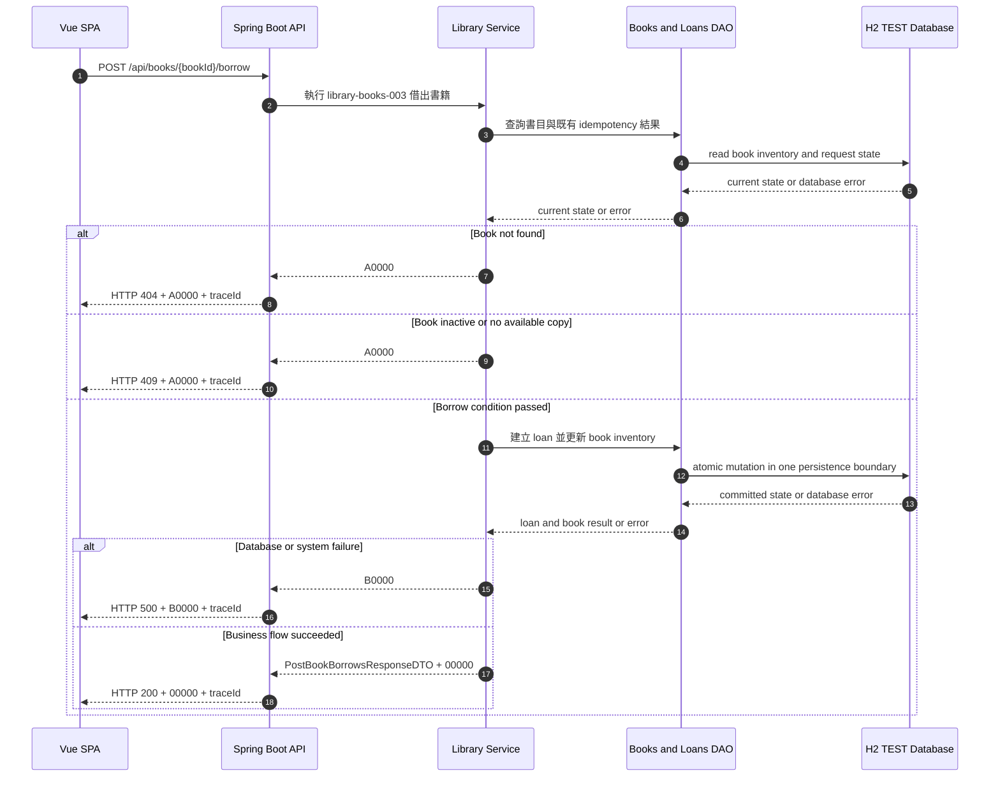

# library-books-003 借出書籍 API Flow

## 1. 修改紀錄

| Version | Who | When | Why / What |
| --- | --- | --- | --- |
| 1.0.0 | Codex / SD | 2026-09-08 | 建立 TEST MVP 借出、扣減庫存與借閱紀錄流程。 |

## 2. API Flow

### 2.1 Workflow Sequence Diagram

CORS: ignored for test to accelerate development。此決策只適用 TEST，不得推廣為 production policy。

## 3. Execute Business Logic

### Detailed Logic

1. OpenAPI Generator 已處理 request constraint、型別與格式驗證；本文件不重複定義欄位規則。
2. Service 依 bookId 取得書目，並依 Idempotency-Key 判斷是否已有已確認的相同結果。
3. 若書目不存在、未上架或 available count 為零，停止 mutation 並回傳 `A0000`。
4. 借出成功時，Service 在單一 H2 persistence transaction boundary 內建立一筆 ACTIVE loan、減少一個 available count，並依結果更新 book status。
5. 借出後 available count 大於零時 status 為 `AVAILABLE`；等於零時 status 為 `BORROWED`。total count 不可被改變。
6. 若同一 Idempotency-Key 的結果已提交，回傳原結果；若 request payload 與原結果不一致，回傳 conflict 的 `A0000`，不得執行第二次 mutation。
7. dueDate 可依 OpenAPI 傳入；MVP 不計算逾期罰款。成功結果交給 API layer 組成 `PostBookBorrowsResponseDTO`。

### Given / When / Then

- Given bookId 對應已上架書目，available count 大於零，且 readerId 與 Idempotency-Key 有效
- When application service 執行 `library-books-003`
- Then 建立一筆 ACTIVE loan、可借數減一、狀態依數量更新，並回傳 `00000`
- Given 書目不存在、未上架、無可借複本或已處理相同 Idempotency-Key
- When application service 執行借出
- Then 回傳對應的 `A0000`，且不可產生額外 loan 或錯誤扣庫存

## 4. 錯誤代碼 (Error Codes)

### 4.1 Business Code Definition

全域 business code 定義以 [`docs/error-codes.md`](../error-codes.md) 為唯一來源。HTTP status 不能取代 business code，request constraint 的具體規則只定義在 [`docs/openapi.yaml`](../openapi.yaml)。

### 4.2 API-specific Error Mapping

| HTTP Status | Business Code | Trigger | Response Behavior | Retryable |
| --- | --- | --- | --- | --- |
| `200` | `00000` | 借閱紀錄建立、庫存扣減與狀態更新成功，或重放相同已確認結果。 | 回傳 `PostBookBorrowsResponseDTO` 與 `traceId`。 | 否 |
| `400` | `A0000` | readerId、dueDate 或其他 business condition 不符合 contract。 | 回傳錯誤訊息與 `traceId`，不修改資料。 | 否 |
| `404` | `A0000` | bookId 找不到書目。 | 回傳資源不存在訊息與 `traceId`。 | 否，修正 bookId 後可重試 |
| `409` | `A0000` | 書籍未上架、無可借複本、idempotency conflict 或庫存版本衝突。 | 回傳衝突訊息與 `traceId`，不產生部分 mutation。 | 依原因決定；重新載入後可重試 |
| `500` | `B0000` | H2 transaction 或內部服務發生未預期錯誤。 | 隱藏內部細節，回傳 `traceId`；結果未確認前 client 不可盲目重試。 | 否，先查詢結果 |

TEST 無 runtime third-party dependency，因此本 API 不使用 `C0000`。
