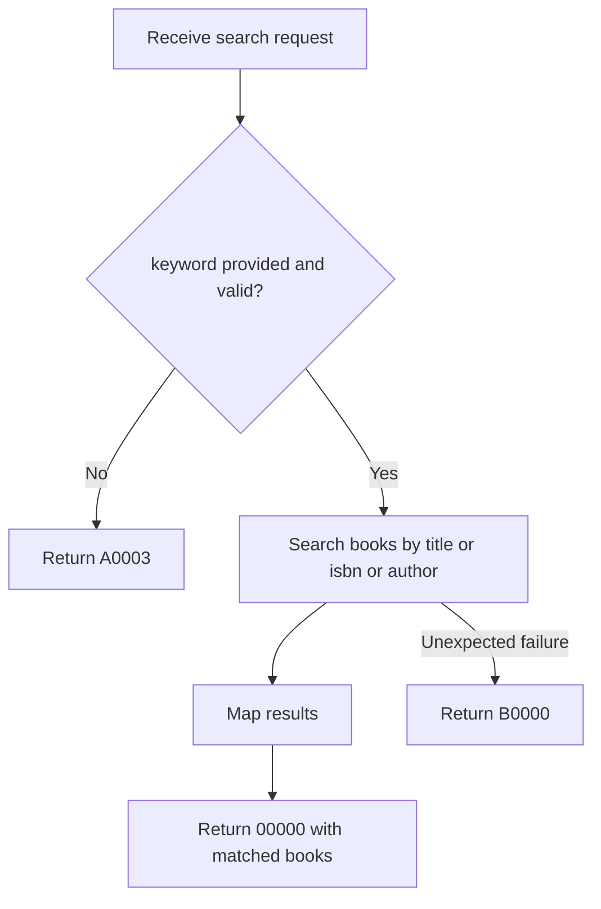

# API Flow: library-books-003 Search Books

- API ID: `library-books-003`
- Path: `GET /library/books/search`

## Main Flow

## Given/When/Then Rules

1. Given non-empty `keyword`
   When `GET /library/books/search` is called
   Then search by title/ISBN/author and return `00000`.

2. Given missing or empty `keyword`
   When `GET /library/books/search` is called
   Then return `A0003`.

3. Given query execution error
   When search operation executes
   Then return `B0000`.
