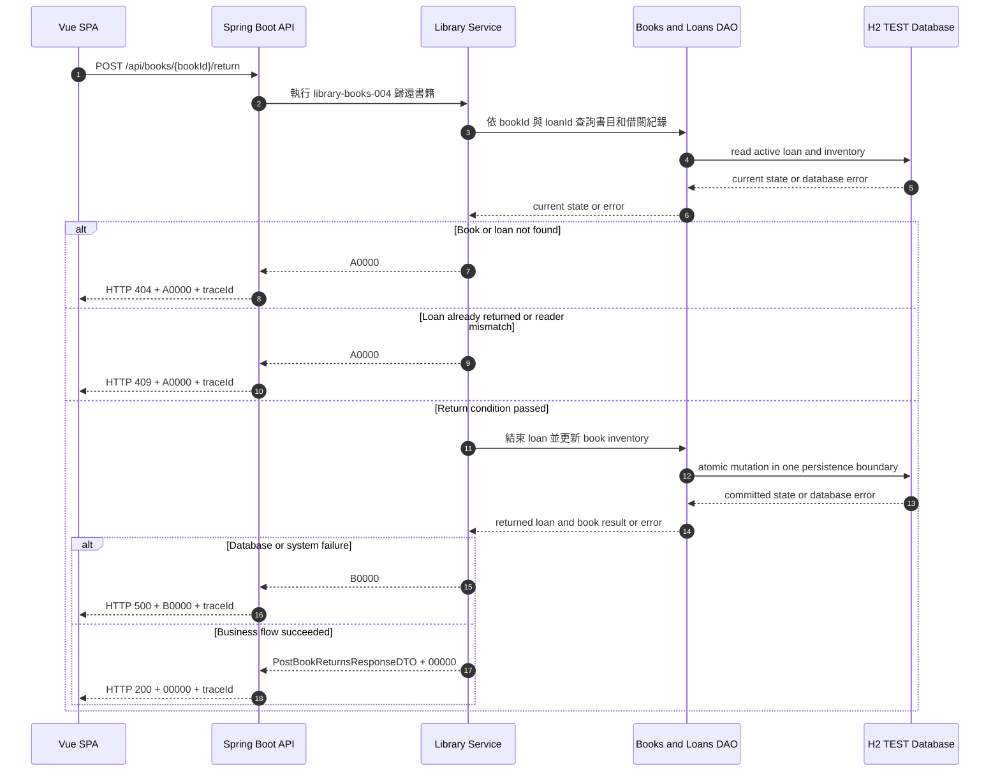

# library-books-004 歸還書籍 API Flow

## 1. 修改紀錄

| Version | Who | When | Why / What |
| --- | --- | --- | --- |
| 1.0.0 | Codex / SD | 2026-09-08 | 建立 TEST MVP 以唯一 loan identity 歸還並恢復庫存流程。 |

## 2. API Flow

### 2.1 Workflow Sequence Diagram

CORS: ignored for test to accelerate development。此決策只適用 TEST，不得推廣為 production policy。

## 3. Execute Business Logic

### Detailed Logic

1. OpenAPI Generator 已處理 request constraint、型別與格式驗證；本文件不重複定義欄位規則。
2. Service 以 bookId 與唯一 loanId 取得目標書目與 ACTIVE loan；不得只用 ISBN 在多複本情況下猜測借閱紀錄。
3. 書目或 loan 不存在時停止 mutation 並回傳 `A0000`；loan 已 RETURNED 時也不得重複歸還。
4. 若 request 帶 readerId，Service 可驗證它與目標 loan 一致；不一致時停止 mutation 並回傳 conflict 的 `A0000`。
5. 歸還成功時，Service 在單一 H2 persistence transaction boundary 內將 loan 標記為 RETURNED、設定歸還時間、增加一個 available count，並依結果更新 book status。
6. available count 等於 total count 時 status 為 `AVAILABLE`；仍有未歸還複本時 status 維持 `BORROWED`。total count 不可被改變。
7. MVP 不計算逾期罰款；dueDate 只作為借閱資料的可選資訊。成功結果交給 API layer 組成 `PostBookReturnsResponseDTO`。

### Given / When / Then

- Given bookId 與 loanId 對應一筆 ACTIVE loan，且 loan 所屬書目可被讀寫
- When application service 執行 `library-books-004`
- Then 結束該筆 loan、可借數增加一、狀態依數量更新，並回傳 `00000`
- Given loan 不存在、已 RETURNED、readerId 不一致或 H2 mutation 失敗
- When application service 執行歸還
- Then 回傳 `A0000` 或 `B0000`，且不得重複增加可借數

## 4. 錯誤代碼 (Error Codes)

### 4.1 Business Code Definition

全域 business code 定義以 [`docs/error-codes.md`](../error-codes.md) 為唯一來源。HTTP status 不能取代 business code，request constraint 的具體規則只定義在 [`docs/openapi.yaml`](../openapi.yaml)。

### 4.2 API-specific Error Mapping

| HTTP Status | Business Code | Trigger | Response Behavior | Retryable |
| --- | --- | --- | --- | --- |
| `200` | `00000` | 指定 ACTIVE loan 歸還成功，庫存與書目狀態同步更新。 | 回傳 `PostBookReturnsResponseDTO` 與 `traceId`。 | 否 |
| `400` | `A0000` | loanId 或其他 business condition 不符合 contract。 | 回傳錯誤訊息與 `traceId`，不修改資料。 | 否 |
| `404` | `A0000` | bookId 或 loanId 找不到目標資料。 | 回傳資源不存在訊息與 `traceId`。 | 否，修正識別值後可重試 |
| `409` | `A0000` | loan 已歸還、readerId 不一致或庫存版本衝突。 | 回傳衝突訊息與 `traceId`，不產生部分 mutation。 | 重新載入後可重試 |
| `500` | `B0000` | H2 transaction 或內部服務發生未預期錯誤。 | 隱藏內部細節，回傳 `traceId`；結果未確認前 client 不可盲目重試。 | 否，先查詢結果 |

TEST 無 runtime third-party dependency，因此本 API 不使用 `C0000`。
