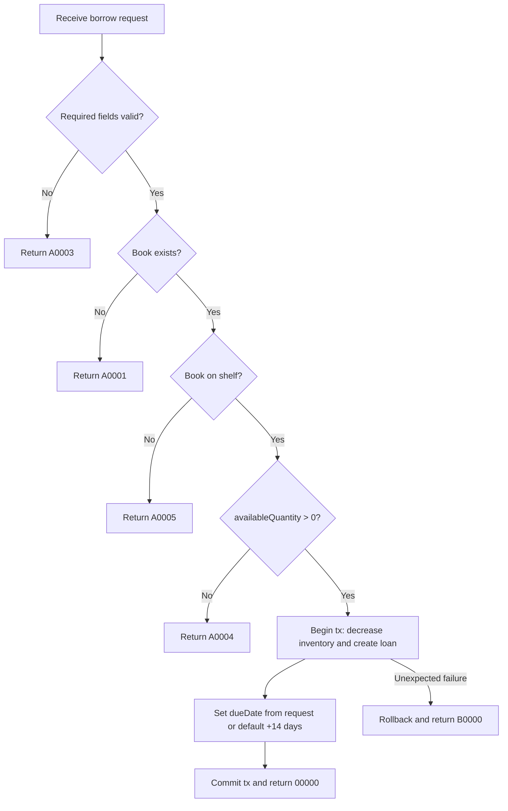

# API Flow: library-loans-001 Borrow Book

- API ID: `library-loans-001`
- Path: `POST /library/loans`

## Main Flow

## Given/When/Then Rules

1. Given valid `readerId` and existing `isbn` with available stock on shelf
   When `POST /library/loans` is called
   Then create loan, decrease available quantity by 1, and return `00000`.

2. Given missing required fields
   When `POST /library/loans` is called
   Then return `A0003`.

3. Given target `isbn` does not exist
   When `POST /library/loans` is called
   Then return `A0001`.

4. Given book shelf status is off shelf
   When `POST /library/loans` is called
   Then return `A0005`.

5. Given `availableQuantity` equals 0
   When `POST /library/loans` is called
   Then return `A0004`.

6. Given due date is omitted
   When borrow succeeds
   Then apply default due date as borrowed date + 14 days.
