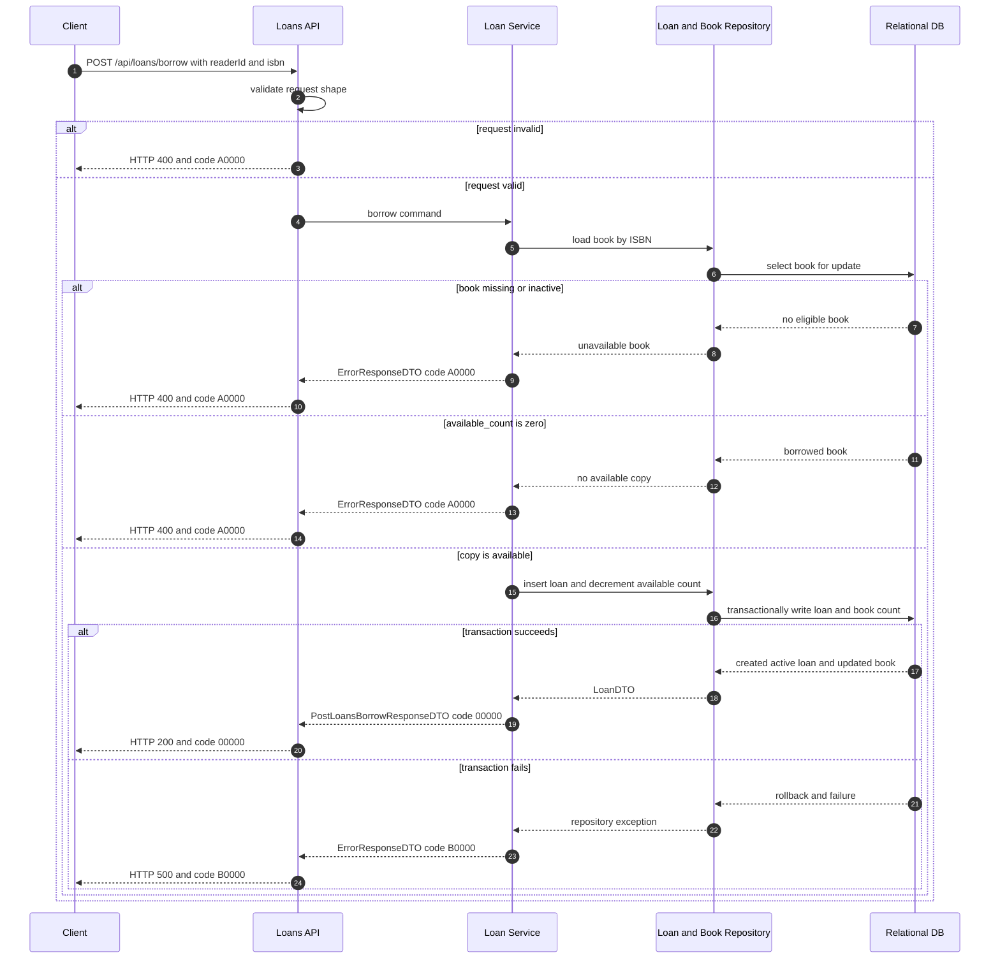

# library-loans-001 借出書籍 API Flow

## 1. 修改紀錄

| Version | Who | When | Why / What |
| --- | --- | --- | --- |
| 1.0.0 | SD | 2026-09-04 | 定義以 ISBN 借出書籍、建立 active loan 與扣減可借數量的交易流程。 |
| 1.0.1 | SD | 2026-09-07 | 引用環境化 CORS policy；dev／poc／test bypass，避免 browser preflight 阻塞 API flow。 |

## 2. API Flow

- API ID: `library-loans-001`
- HTTP Method: `POST`
- Path: `/api/loans/borrow`
- OpenAPI operationId: `postLoansBorrow`
- Request DTO: `PostLoansBorrowRequestDTO`
- Response DTO: `PostLoansBorrowResponseDTO`
- Contract source: `docs/openapi.yaml`
- Authentication context: test-only default Admin; `readerId` is a synthetic request value, not a login identity.
- Environment CORS policy: follow `x-environment-cors-policy` in
  `docs/openapi.yaml`; `dev`／`poc`／`test` bypass origin validation and allow
  preflight, while staging／production require an explicit allowlist.

### 2.1 Workflow Sequence Diagram

## 3. Execute Business Logic

### Detailed Logic

1. API layer validates the required synthetic `readerId` and ISBN.
2. Service loads the book by ISBN in a transaction-safe manner and requires `is_active = true` and `available_count > 0`.
3. Service creates an active `loans` row with `returned_at = NULL`, then decrements `books.available_count` by one in the same transaction.
4. The service maps the created row to `PostLoansBorrowResponseDTO`; the book status is derived and is not stored on `loans`.
5. No penalty, notification, external service, or authentication lookup is performed in this MVP.

### Given / When / Then

- Given the ISBN identifies an active book with an available copy and `readerId` is non-empty.
- When the client sends `POST /api/loans/borrow`.
- Then the API creates an active loan and returns HTTP 200 with code `00000`.
- Given the ISBN does not identify a book or the book is inactive, When the borrow request is processed, Then the API returns HTTP 400 with code `A0000` and does not create a loan.
- Given `available_count` is zero, When the borrow request is processed, Then the API returns HTTP 400 with code `A0000` and does not decrement the count below zero.
- Given the loan insert or book update cannot be committed, When the transaction completes, Then the transaction is rolled back and the API returns HTTP 500 with code `B0000`.

## 4. 錯誤代碼 (Error Codes)

本 API 遵循 [`docs/error-codes.md`](../error-codes.md) 的業務錯誤碼與 HTTP status 規則。

### 4.2 API-specific Error Mapping

| HTTP status | Business code | Condition | Client behavior |
| --- | --- | --- | --- |
| 200 | `00000` | Active book has at least one available copy and the transaction commits. | Show the new loan and refreshed availability. |
| 400 | `A0000` | Invalid request, unknown book, inactive book, or no available copy. | Show the business message; do not retry unchanged. |
| 500 | `B0000` | Transaction or unexpected internal failure. | Show a generic failure and retain `traceId`. |
