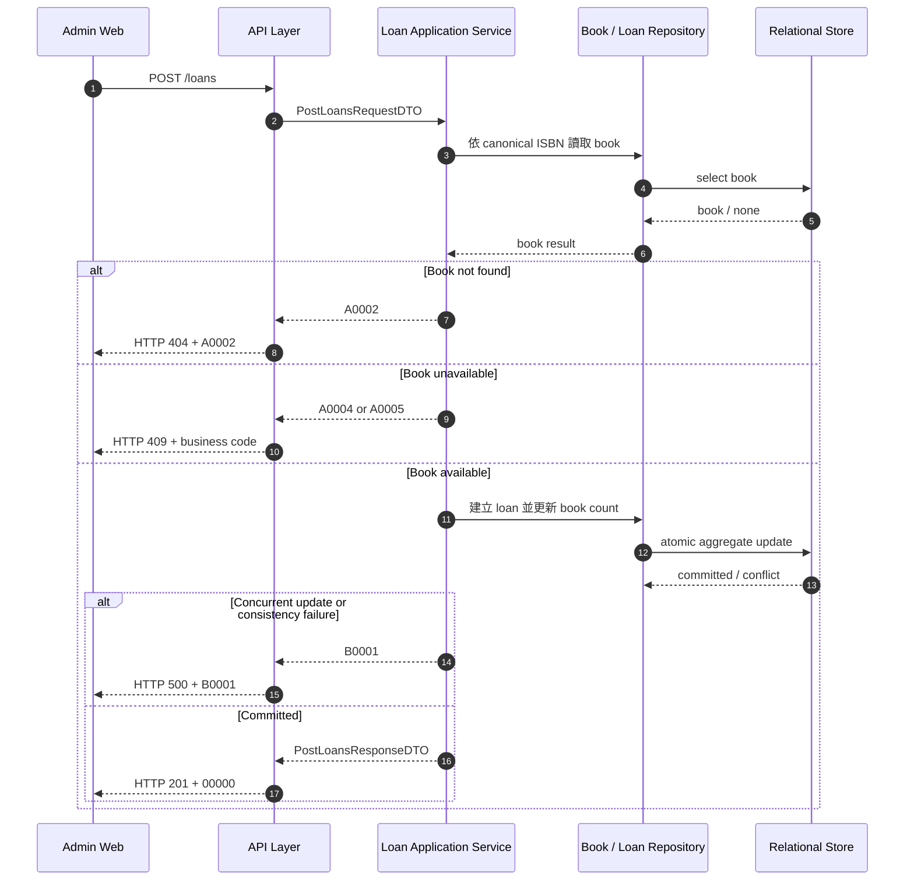

# `library-loans-001`｜借出書籍 API Flow

## 1. 修改紀錄

| Version | Who | When | Why / What |
| --- | --- | --- | --- |
| 1.0.0 | Codex / SD | 2026-09-01 | 依 REQ-LIB-001 與 OpenAPI 建立借書 application service flow。 |

## 2. API Flow

- API ID：`library-loans-001`
- OpenAPI operation：`POST /loans`（`operationId: postLoans`）
- Contract source：[`docs/openapi.yaml`](../openapi.yaml)

### 2.1 Workflow Sequence Diagram

## 3. Execute Business Logic

OpenAPI 已處理 request constraint、型別與格式驗證；本文件不重複定義欄位限制。

### Detailed Logic

1. 將 ISBN 轉為 canonical form，依 canonical ISBN 讀取書籍聚合。
2. 找不到書籍時停止流程，回傳 `A0002`。
3. 書籍未上架時停止流程，回傳 `A0005`；可借數為 0 時停止流程，回傳 `A0004`。
4. 書籍可借時，在同一 consistency boundary 建立一筆借閱中 loan，並將 `availableCount` 減少 1；若減至 0，書籍狀態改為 `borrowed`，否則維持 `available`。
5. `dueDate` 若有值則保存；本 MVP 不自動補預設期限，也不計算逾期或罰款，待 Q-003 決策。
6. 若競爭更新使 Store 無法確認兩項異動同時提交，整體視為未成功，回傳 `B0001`，不得只提交其中一項。
7. 成功後由 API layer 組成 `PostLoansResponseDTO` 與 `00000`。

### Given / When / Then

- Given ISBN 對應的書籍已上架且 `availableCount > 0`
- When application service 執行借書
- Then 建立借閱中紀錄、可借數減 1，必要時轉為 `borrowed`，並回傳 `00000`

- Given ISBN 不存在、書籍未上架或沒有可借副本
- When application service 執行借書
- Then 不建立 loan、不改變館藏數量，分別回傳 `A0002`、`A0005` 或 `A0004`

## 4. 錯誤代碼 (Error Codes)

全域定義請參照 [`docs/error-codes.md`](../error-codes.md)。

| HTTP Status | Business Code | Trigger | Response Behavior | Retryable |
| --- | --- | --- | --- | --- |
| `201` | `00000` | 借閱紀錄與館藏數量同步成功。 | 回傳 `PostLoansResponseDTO`、成功訊息與 `traceId`。 | 否；重送可能建立另一筆借閱 |
| `400` | `A0001` | OpenAPI request constraint 未通過。 | 回傳欄位細節；不建立 loan。 | 否 |
| `404` | `A0002` | ISBN 找不到書籍。 | 回傳找不到書籍訊息；不異動資料。 | 否 |
| `409` | `A0004` | 無可借副本。 | 回傳庫存狀態訊息；不異動資料。 | 否 |
| `409` | `A0005` | 書籍未上架。 | 回傳不可借閱訊息；不異動資料。 | 否 |
| `500` | `B0000` | 非預期 API／Store 錯誤。 | 隱藏內部細節，以 `traceId` 關聯 log。 | 通常否 |
| `500` | `B0001` | 借閱紀錄與館藏數量無法一致提交。 | 不顯示成功，要求重新載入。 | 僅確認未提交後可重試 |
