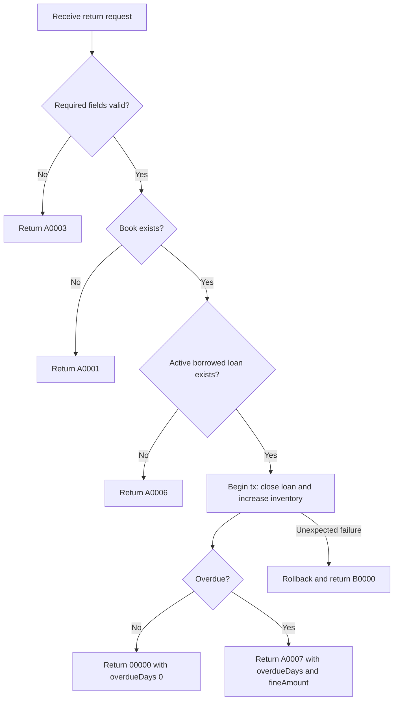

# API Flow: library-loans-002 Return Book

- API ID: `library-loans-002`
- Path: `POST /library/loans/returns`

## Main Flow

## Given/When/Then Rules

1. Given existing `isbn` and active borrowed loan
   When `POST /library/loans/returns` is called
   Then close loan and increase available quantity by 1.

2. Given return is on time
   When return succeeds
   Then return `00000` and set `overdueDays = 0`, `fineAmount = 0`.

3. Given return is overdue
   When return succeeds
   Then return `A0007` and include overdue days and fine amount.

4. Given target `isbn` does not exist
   When return is requested
   Then return `A0001`.

5. Given no active borrowed loan exists
   When return is requested
   Then return `A0006`.

6. Given request payload is invalid
   When return is requested
   Then return `A0003`.
