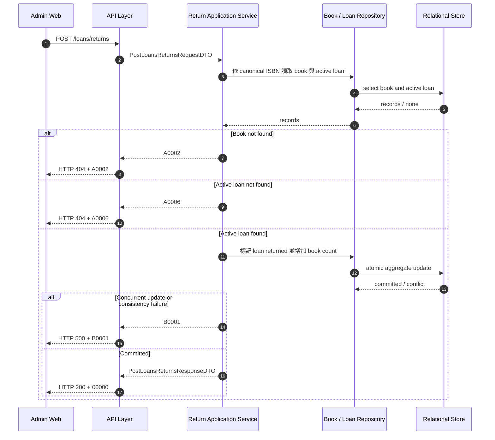

# `library-loans-002`｜歸還書籍 API Flow

## 1. 修改紀錄

| Version | Who | When | Why / What |
| --- | --- | --- | --- |
| 1.0.0 | Codex / SD | 2026-09-01 | 依 REQ-LIB-001 與 OpenAPI 建立還書 application service flow。 |

## 2. API Flow

- API ID：`library-loans-002`
- OpenAPI operation：`POST /loans/returns`（`operationId: postLoansReturns`）
- Contract source：[`docs/openapi.yaml`](../openapi.yaml)

### 2.1 Workflow Sequence Diagram

```mermaid
sequenceDiagram
    autonumber
    participant Client as Admin Web
    participant API as API Layer
    participant Service as Return Application Service
    participant Repository as Book / Loan Repository
    participant Database as Relational Store

    Client->>API: POST /loans/returns
    API->>Service: PostLoansReturnsRequestDTO
    Service->>Repository: 依 canonical ISBN 讀取 book 與 active loan
    Repository->>Database: select book and active loan
    Database-->>Repository: records / none
    Repository-->>Service: records
    alt Book not found
        Service-->>API: A0002
        API-->>Client: HTTP 404 + A0002
    else Active loan not found
        Service-->>API: A0006
        API-->>Client: HTTP 404 + A0006
    else Active loan found
        Service->>Repository: 標記 loan returned 並增加 book count
        Repository->>Database: atomic aggregate update
        Database-->>Repository: committed / conflict
        alt Concurrent update or consistency failure
            Service-->>API: B0001
            API-->>Client: HTTP 500 + B0001
        else Committed
            Service-->>API: PostLoansReturnsResponseDTO
            API-->>Client: HTTP 200 + 00000
        end
    end
```

## 3. Execute Business Logic

OpenAPI 已處理 request constraint、型別與格式驗證；本文件不重複定義欄位限制。

### Detailed Logic

1. 將 ISBN 轉為 canonical form，讀取對應書籍與借閱中紀錄（`returnedAt IS NULL`）。
2. 找不到書籍時停止流程，回傳 `A0002`。
3. 沒有借閱中紀錄時停止流程，回傳 `A0006`。
4. 若提供 `readerId`，依 Q-001 的決策判定是否必須與借閱紀錄相符；在該決策未凍結前，欄位可作識別資訊傳入但不額外擴張會員驗證。
5. 在同一 consistency boundary 將借閱紀錄標記為已歸還，並將 `availableCount` 增加 1；若恢復至 `totalCount`，書籍狀態改為 `available`。
6. 本 MVP 不執行逾期或罰款計算；`overdueDays`／`fine` 只有在 Q-003 凍結後才可加入業務行為。
7. 若競爭更新或完整性檢查使兩項異動無法同時提交，整體視為未成功，回傳 `B0001`。
8. 成功後由 API layer 組成 `PostLoansReturnsResponseDTO` 與 `00000`。

### Given / When / Then

- Given ISBN 對應書籍存在且至少有一筆借閱中紀錄
- When application service 執行還書
- Then 借閱紀錄標記為已歸還、可借數增加 1，必要時轉為 `available`，並回傳 `00000`

- Given ISBN 不存在或沒有借閱中紀錄
- When application service 執行還書
- Then 不改變館藏與借閱狀態，分別回傳 `A0002` 或 `A0006`

## 4. 錯誤代碼 (Error Codes)

全域定義請參照 [`docs/error-codes.md`](../error-codes.md)。

| HTTP Status | Business Code | Trigger | Response Behavior | Retryable |
| --- | --- | --- | --- | --- |
| `200` | `00000` | 借閱紀錄與館藏數量同步歸還成功。 | 回傳 `PostLoansReturnsResponseDTO`、成功訊息與 `traceId`。 | 否；重送可能被判定為無 active loan |
| `400` | `A0001` | OpenAPI request constraint 未通過。 | 回傳欄位細節；不異動資料。 | 否 |
| `404` | `A0002` | ISBN 找不到書籍。 | 回傳找不到書籍訊息；不異動資料。 | 否 |
| `404` | `A0006` | 沒有借閱中紀錄可歸還。 | 回傳無可歸還紀錄訊息；不異動資料。 | 否 |
| `500` | `B0000` | 非預期 API／Store 錯誤。 | 隱藏內部細節，以 `traceId` 關聯 log。 | 通常否 |
| `500` | `B0001` | 歸還紀錄與館藏數量無法一致提交。 | 不顯示成功，要求重新載入。 | 僅確認未提交後可重試 |
