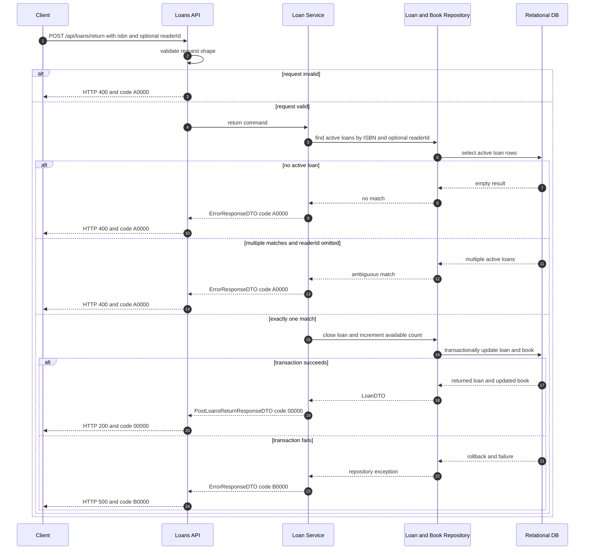

# library-loans-002 歸還書籍 API Flow

## 1. 修改紀錄

| Version | Who | When | Why / What |
| --- | --- | --- | --- |
| 1.0.0 | SD | 2026-09-04 | 定義以 ISBN 歸還 active loan、處理多筆借閱歧義與回補可借數量的流程。 |

## 2. API Flow

- API ID: `library-loans-002`
- HTTP Method: `POST`
- Path: `/api/loans/return`
- OpenAPI operationId: `postLoansReturn`
- Request DTO: `PostLoansReturnRequestDTO`
- Response DTO: `PostLoansReturnResponseDTO`
- Contract source: `docs/openapi.yaml`
- Authentication context: test-only default Admin; optional `readerId` is a synthetic selector, not a login identity.

### 2.1 Workflow Sequence Diagram

## 3. Execute Business Logic

### Detailed Logic

1. API layer validates the required ISBN and optional synthetic `readerId`.
2. Service finds active loans for the ISBN, where active means `returned_at IS NULL`. When `readerId` is supplied, it narrows the match to that synthetic reader.
3. If there is no match, or if more than one active loan matches while `readerId` is omitted, service returns a correctable business error and changes no row.
4. For exactly one match, service sets `returned_at` and increments the corresponding book `available_count` in the same transaction.
5. No fine calculation, notification, external service, or authentication lookup is performed in this MVP.

### Given / When / Then

- Given exactly one active loan matches the ISBN.
- When the client sends `POST /api/loans/return`.
- Then the API closes that loan, increments availability, and returns HTTP 200 with code `00000`.
- Given multiple active loans match the ISBN and `readerId` is omitted, When the return request is processed, Then the API returns HTTP 400 with code `A0000` and asks the client to identify the reader.
- Given `readerId` is supplied and identifies exactly one active loan for the ISBN, When the return request is processed, Then only that loan is closed and code `00000` is returned.
- Given no active loan matches, When the return request is processed, Then the API returns HTTP 400 with code `A0000` and does not increase availability.
- Given the loan update or book update cannot be committed, When the transaction completes, Then the transaction is rolled back and the API returns HTTP 500 with code `B0000`.

## 4. 錯誤代碼 (Error Codes)

本 API 遵循 [`docs/error-codes.md`](../error-codes.md) 的業務錯誤碼與 HTTP status 規則。

### 4.2 API-specific Error Mapping

| HTTP status | Business code | Condition | Client behavior |
| --- | --- | --- | --- |
| 200 | `00000` | Exactly one active loan is selected and the transaction commits. | Show the returned loan and refreshed availability. |
| 400 | `A0000` | Invalid request, no active loan, or ambiguous match without `readerId`. | Show the correction message; do not retry unchanged. |
| 500 | `B0000` | Transaction or unexpected internal failure. | Show a generic failure and retain `traceId`. |
