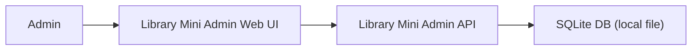
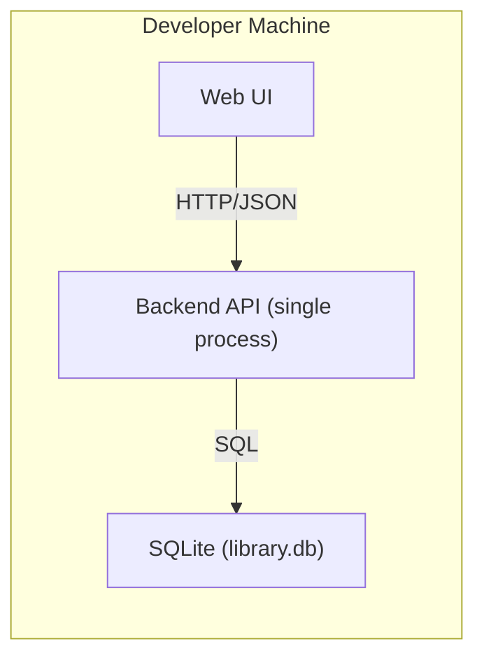

# ARCH-LIB-001 MVP 系統架構（Archi）

## 1. 文件目的與範圍

- 需求來源：`REQ-LIB-001`
- 目標：在**SQLite、無快取、本地可直接執行、無外部服務**前提下，定義 MVP 的系統層架構。
- 本文件僅涵蓋：系統脈絡、容器邊界、部署拓撲、技術選型取捨、NFR 對策、成本與風險。
- 本文件不涵蓋：資料模型欄位、API 契約、交易流程、錯誤碼欄位映射（移交 SD）。

## 2. 架構決策與取捨

### 2.1 關鍵決策

1. 採用單體架構（Monolith）實作 MVP，降低跨服務協作與維運成本。
2. 採用 SQLite 作為唯一持久層，確保本地可啟動且無外部依賴。
3. 不導入快取、MQ、排程器、搜尋引擎或第三方雲服務。
4. 維持單機部署模型，優先滿足快速交付與可重現開發環境。

### 2.2 主要取捨

- 以低複雜度換取較低擴展性：MVP 階段可接受。
- 以單機資料庫換取高可移植性：高併發能力非此階段目標。
- 不做快取可降低一致性風險，但查詢效能優化空間有限。

## 3. 系統脈絡（C4-L1）

### 3.1 C4-L1 描述

- 角色：Admin（管理員）
- 系統：Library Mini Admin Console
- 互動：Admin 透過 Web UI 操作，UI 呼叫本地 API，API 讀寫 SQLite。

### 3.2 C4-L1 Mermaid

## 4. 容器視圖（C4-L2）

### 4.1 C4-L2 描述

- Container A：Web UI
- 職責：提供管理介面、觸發新增/借還/查詢操作、呈現結果。
- Container B：Backend API
- 職責：承接業務請求、執行規則、回傳一致的業務結果。
- Container C：SQLite
- 職責：保存館藏與借還資料。

### 4.2 C4-L2 Mermaid

## 5. 部署拓撲與本地運行模型

- 拓撲：單機 1 個 Web 進程 + 1 個 API 進程 + 1 個 SQLite 檔案。
- 環境：本地開發機即可完整運行，不需外部基礎設施。
- 運行原則：
  - API 與 Web 可分開啟動，或由專案腳本同時啟動。
  - SQLite 檔案路徑需可配置，預設放在專案可寫目錄。

## 6. NFR 對應（系統層）

| NFR | 系統層對策 |
| --- | --- |
| NFR-001 一致性與即時回饋 | 採單體 + 單資料庫，避免跨服務一致性問題 |
| NFR-002 業務錯誤碼治理 | 後端統一業務回應策略，由單一 API 入口治理 |
| NFR-003 可用性 | UI 與 API 同機部署，縮短回饋路徑，降低環境差異 |
| NFR-004 可測試性 | 單機可重現拓撲，便於整合測試與 E2E 驗證 |

## 7. 成本與複雜度控制

- 人力成本：單體架構降低溝通與整合成本。
- 維運成本：SQLite 無需額外資料庫服務維護。
- 工程成本：不引入快取與外部服務，減少設定與故障面。
- 風險控制：將擴展性議題延後到需求證實後再投資。

## 8. 風險與非目標

### 8.1 主要風險

1. SQLite 在高寫入併發下吞吐受限。
2. 單體部署在規模增長後需再拆分。
3. 搜尋/報表等功能擴張可能推升資料層與 API 複雜度。

### 8.2 非目標（MVP 不做）

1. 不做微服務拆分。
2. 不做快取層。
3. 不做外部通知與第三方整合。
4. 不做跨機高可用與災難復原。

## 9. 移交 SD 項目（Archi 不定稿）

以下由 SD 文件承接與定稿：

1. 資料模型與 Schema（含 DDL、索引、欄位約束）。
2. API 契約（路徑、DTO、欄位定義、OpenAPI）。
3. 交易與併發控制細節（借書/還書流程、鎖與衝突處理）。
4. 錯誤碼到 API 回應欄位的映射規格。
5. 模組內部分層與程式結構細節。

## 10. 擴展觸發條件（後續）

- 當並發量、資料量或功能邊界超出單機 SQLite 可承載範圍時，評估：
  - 升級至 client-server DB（如 PostgreSQL）
  - 補強觀測能力
  - 逐步拆分服務邊界
