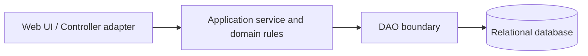
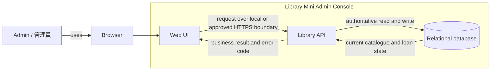
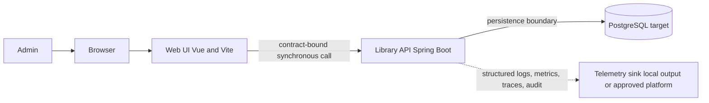

# ARCH-LIB-001 系統架構（Archi）

## 1. 文件目的與範圍

- 需求來源：`docs/requirements/REQ-LIB-001.md`
- 場景 / workflow：`SCN-LIB-001` / `docs/workflows/WF-LIB-001.md`
- 架構目標：為共享書櫃 MVP 提供可被 SD 與 PG 接手的系統邊界、環境策略、控制面與演進門檻。
- 文件範圍：系統層的 Web UI、Library API、持久化、部署、身份／安全、可追蹤性、可用性、效能及營運控制。
- 不含範圍：API path、DTO、response envelope、資料表／DDL／index、transaction step、lock strategy、SQL、程式碼與 module-internal package layout。
- 文件狀態：Ready for SD（test-only architecture；不包含 PROD 部署承諾）

### 1.1 標準環境 profile 對應表

環境名稱是 label，profile 才是用途。本文件只選擇需求已證實需要的 profile；未採用 profile 不建立實際環境。

| Profile | 主要目的 | 典型資料 | HA / 可用性 | 依賴模式 | 觀測與發布閘門 | 生命週期 |
| --- | --- | --- | --- | --- | --- | --- |
| `LOCAL` / `DEV` | 個人開發與快速回饋 | synthetic / local seed | 預設無 HA | local / stub / mock | developer log、automated check | 長期或 branch-based |
| `POC` | 技術可行性與學習 | synthetic / 嚴格遮罩 | 最小拓撲、成本優先 | mock / stub / sandbox / 選定 real | 決策證據、targeted telemetry | 臨時 |
| `TEST` / `QA` | 功能、回歸與品質測試 | generated / synthetic / 遮罩 | 通常單一執行個體 | mock / sandbox | test report、quality gate | 可選、長期或 ephemeral |
| `SIT` | 系統與外部整合驗證 | controlled / synthetic / 遮罩代表資料 | 代表性拓撲；除非測 HA 否則不強制 | sandbox / controlled endpoint | centralized telemetry、integration gate | 通常長期 |
| `UAT` | 業務驗收 release candidate | 遮罩代表資料 | 依驗收需要接近 PROD | business-approved sandbox / pre-prod | acceptance evidence、sign-off | 可選、臨時或長期 |
| `PROD` | 正式業務運作 | 受正式政策管理的 production data | agreed SLO、HA、RTO/RPO、backup、DR | production dependencies | full telemetry、alert、on-call、change/recovery gate | 長期 |

### 1.2 本專案實際環境與需求確認

使用者已確認本次只需要 `test` profile；`local` 是 repo 既有的開發運行模型。SIT、UAT、PROD 不在本次範圍，且不得由 test promotion 直接推定為正式部署就緒。

| 實際環境名稱 | 對應 profile | 是否納入 | 目的與成功條件 | 使用者確認狀態 |
| --- | --- | --- | --- | --- |
| `local` | `LOCAL` | 是 | 以 synthetic／local seed 啟動 Web 與 API，完成 automated check 與本地 scenario smoke flow。 | Assumed |
| `test` | `TEST` | 是 | 以 synthetic／generated data 執行功能、回歸與 scenario acceptance；通過 test report 與 quality gate。 | Confirmed |

未採用的 `SIT`、`UAT`、`PROD` 不建立本次環境；若未來納入，需重新確認正式 hosting、資料政策、HA、backup、security 與 on-call，不得沿用本 test-only 架構假設。

### 1.3 假設、問題與追蹤

| ID | 假設 / 待確認問題 | 為何影響架構 | 狀態 | 負責人 / 驗證點 |
| --- | --- | --- | --- | --- |
| A-001 | 本次只需要 `local` 與 `test`；SIT／UAT／PROD 不納入。test 用於功能／回歸／scenario quality gate。 | 決定部署拓撲、資料政策與 promotion 邊界；不建立正式環境能力。 | Confirmed | 使用者／Archi；2026-09-04 回覆 |
| A-002 | test 使用預設管理員、免登入；不導入 SSO／MFA／RBAC。 | 簡化 test ingress 與應用控制面，但只能在隔離測試環境使用。 | Confirmed | 使用者／Archi；2026-09-04 回覆 |
| A-003 | test 不加密；只允許 synthetic／generated reader identity 與借閱資料，不承載 production 或真實個資。 | 取消 test encryption 複雜度，但若資料範圍改變必須重新做安全架構。 | Confirmed | 使用者／Archi；2026-09-04 回覆與 test data gate |
| A-004 | 不要求 SLO／SLA、HA、RTO／RPO、backup／DR 或 on-call。 | 可採單一執行個體與 best-effort test；不可宣稱 PROD 可用性。 | Confirmed | 使用者／Archi；2026-09-04 回覆 |
| A-005 | 以內部小型管理工具、正常同時管理員不超過 20 人、館藏不超過 10,000 筆作初步容量估算。 | 支持單體同步 API、無 cache 與單一資料庫；若不成立需重新估算。 | Assumed | Archi／PG；壓測與實際使用量確認 |
| A-006 | 館藏與借閱狀態必須讀到最新成功結果；MVP 不使用 cache。 | 避免借閱數量與狀態出現 stale read；可降低 Redis 等額外維運成本。 | Assumed | Archi／SD；REQ NFR-001 驗證與容量指標 |
| A-007 | 本場景沒有第三方服務與 MQ；所有核心流程為同步請求。 | 支持單一 API 邊界，不需要 asynchronous delivery、DLQ、outbox 或 distributed transaction。 | Confirmed | Archi／SD；REQ scope 與架構 review |
| A-008 | Figma Make 匯出是 UI baseline；搜尋、罰款及獨立增加 copies 不在已凍結 MVP。 | 避免為未確認功能增加服務、資料或外部依賴。 | Assumed | SA／業務；REQ Q-003/Q-004/Q-006 decision review |

### 1.4 使用者確認紀錄

2026-09-04 使用者確認：

1. 實際環境選擇 `test`。
2. test 採簡單模式，免登入，預設以管理員身份進入。
3. test 不加密。
4. 不要求 SLO／SLA、HA、RTO／RPO、backup／DR 或 on-call。

上述決策只授權 test-only scope；若日後加入真實個資、公開網路或 PROD，必須重新執行 security、data protection、availability 與 operations readiness gate。

## 2. 技術選型與版本治理

| 領域 | 選定技術／版本 | 版本固定與變更規則 | 選擇理由 | 替代方案與取捨 |
| --- | --- | --- | --- | --- |
| Backend runtime/framework | Java 21；Spring Boot `3.5.12-SNAPSHOT` 為目前 repo baseline，僅作 preliminary baseline | Java major 固定為 21；Spring Boot 必須在 SD／發布前改為核准的 released version，禁止以 snapshot 作 PROD baseline；版本變更需 code review、回歸與安全掃描。 | repo 已使用 Java 21、Spring Boot Web／Actuator；符合同步 CRUD MVP。 | Spring Boot released 3.5.x 或其他 Java Web framework；改用其他 framework 會增加團隊與運行成本。 |
| Build/tooling | Maven Wrapper `3.3.4`；Maven distribution `3.9.12`；`pom.xml` | 使用 `./mvnw` 與 lockable wrapper distribution；plugin version 必須在 `pom.xml` 明確固定，CI 使用可重現命令。 | wrapper 已存在，可讓本地與 CI 使用相同 Maven。 | 全域 Maven 或 Gradle；全域 Maven 可降低 wrapper 維護但降低可重現性，Gradle 會偏離既有 baseline。 |
| API contract generation | OpenAPI Generator Maven plugin `7.25.0` | 版本已在 POM property 固定；`docs/openapi.yaml` 必須獨立版本化；generated API code commit 至 Git，禁止手動編輯，變更只能由 contract／generator 產生。 | repo 已有 generation profile 與 tracked output 約束，支援 FE／BE contract handoff。 | 手寫 controller contract；短期較快但會失去 contract drift gate，故不採用。 |
| Persistence | Relational database；PostgreSQL 16 作 target baseline，local engine／distribution 尚待確認 | PostgreSQL major 16 固定；minor／patch 由 SD／營運在環境 manifest pin；不得以 production data 驗證 local。若採 local substitute，需通過相容性測試。 | 借閱數量、書籍狀態與借閱關係需要 durable consistency；關聯式資料庫可保留未來查詢與稽核擴展空間。 | H2／SQLite 可降低 local 成本但與 target 行為可能不同；document store 不利於跨資源一致性，除非需求改變。 |
| Database migration | Liquibase formatted SQL；版本待 SD 補入 build baseline | changeset immutable、可審查、可在各環境重播；只允許 formatted SQL，禁止 Liquibase XML；migration execution 由部署流程控管。 | repo workflow 明確要求 Liquibase formatted SQL，且可支援可追溯 schema promotion。 | Hibernate auto-DDL 或手動 SQL；前者不可控，後者缺少 migration history，均不採用。 |
| Messaging | N/A | 核心流程不引入 MQ；若未來增加通知／異步整合，須另開架構決策並補 delivery、retry、DLQ、ordering、idempotency 與 consistency 語意。 | scenario 沒有 asynchronous requirement 或第三方依賴。 | Kafka／RabbitMQ 會增加操作、失敗模式與測試成本，目前不採用。 |

前端 baseline 為 Vue `3.5.28`、Vite `7.3.1`、TypeScript `5.9.3`、Node engine `20.19+` 或 `22.12+`，以 `apps/web/library-mini-admin-web/package-lock.json` 與 `npm ci` 保持可重現；package manifest 的 semver range 變更需同步 lockfile、CI check 與瀏覽器回歸。前端 visual source 仍以 `docs/figma/library-mini-admin-console/` 為準。

## 3. 應用架構選型與依賴方向

- 選定模式：三層式 `controller -> service -> dao`。
- 複雜度訊號：目前只有新增書籍、館藏查詢、借出與歸還；無 MQ、第三方整合、跨服務協作或長流程。數量上下限、上架狀態、借閱／歸還一致性是少量但必須集中管理的 domain rules。
- 主要邊界與依賴方向：Web UI 只依賴 API contract；controller／generated API adapter 只接收與轉換 transport 請求；service 持有用例與業務不變量；dao 封裝 relational persistence。依賴方向不得由 domain／service 反向依賴 HTTP、Figma 或 database vendor 細節。
- 若有 MQ：N/A；本場景沒有 MQ，不建立 asynchronous adapter、outbox 或 dead-letter 邊界。
- 交易、delivery、retry、dead-letter、ordering、idempotency 與 consistency 考量：借出／歸還必須是同步且可重試判定的單一業務結果；具體 transaction boundary、重複請求處理與 concurrency implementation 由 SD／BE 定義，本文件只要求不能留下部分更新。
- 選擇理由：以最小複雜度滿足 REQ NFR-001 的一致性與 REQ NFR-004 的錯誤可追蹤性；三層結構足以讓 controller、業務規則與持久化責任分離。
- 未採用替代方案與原因：Clean／Hexagonal 可提高 adapter 替換能力，但目前沒有足夠 integration boundary；引入完整 ports／adapters 會提高 MVP ceremony。若後續加入 identity provider、通知、搜尋索引或外部 library integration，再針對新增邊界局部引入 port。

```mermaid
flowchart LR
    ui[Web UI / Controller adapter]
    service[Application service and domain rules]
    dao[DAO boundary]
    db[(Relational database)]
    ui --> service --> dao --> db
```

## 4. 架構決策與取捨

### 4.1 關鍵決策

| ID | 決策 | 選項與取捨 | 需求依據 | 影響 / 後續觸發條件 |
| --- | --- | --- | --- | --- |
| ADR-001 | 先採單體同步 Web UI + Spring API + relational database | 三層單體成本與部署複雜度最低；拆微服務會引入分散式一致性、部署與 observability 成本。 | REQ FR-001～FR-005、NFR-001 | 流量、團隊邊界或獨立發布需求成長時重新評估。 |
| ADR-002 | 館藏與借閱狀態以 durable relational persistence 為 authoritative source；target baseline 為 PostgreSQL 16 | 可支援一致性與未來 audit；local 是否同 engine 尚待確認。 | REQ NFR-001、BR-003～BR-008 | 若確認為純 demo 且無持久化需求，可改成 local-only；否則 SD 不得以 memory-only 作 shared environment。 |
| ADR-003 | MVP 不使用 cache、MQ 或第三方服務 | 最新狀態優先、資料量小；減少 stale data、queue delivery 與外部 SLA。 | REQ out-of-scope、A-005～A-007 | 量測顯示 list latency、DB load 或整合需求超過門檻時，新增專屬 ADR。 |
| ADR-004 | 架構 Ready for SD，但限制在 local + isolated test | 使用者已確認 test 免登入、不加密、無 HA／SLO／RTO／RPO／backup／DR／on-call；這降低 MVP 成本，但不具備 PROD 安全與營運保證。 | 使用者 2026-09-04 回覆、REQ Q-001～Q-009 | 若 scope 改為 shared／PROD，必須重開 security、data protection、availability 與 operations decision。 |

### 4.2 主要取捨

- 成本：local／test 使用單一 API 與單一資料庫、無 cache／MQ／第三方服務；不引入 HA、DR 或長期 observability service。
- 複雜度：三層式架構可快速交付，但不預先建立完整微服務、CQRS、SAGA、event sourcing 或 outbox。
- 可用性／可靠性：MVP 優先確保單次借出／歸還結果一致；local／test 故障時重建，不承諾服務連續性或資料復原。
- 安全性／維運性：test 免登入、不加密，但以 network isolation、synthetic data、no-public-ingress 形成 scope hard gate；任何共享或 PROD 形態環境必須另做安全與營運決策。

## 5. 系統脈絡（C4-L1）

### 5.1 描述

- 使用者與角色：管理員透過瀏覽器操作新增書籍、查看館藏、借出及歸還；local／test 免登入，進入即為預設 `Admin`，不含多角色差異。
- 外部系統：本 MVP 沒有已確認的第三方系統；identity provider、central telemetry、secrets manager 與 managed database 僅是正式環境候選平台能力，不能視為已核准依賴。
- 信任邊界：Browser 與 Web/API ingress 之間不做 user authentication，但 test ingress 必須 network-isolated 且不公開；API 與 relational database 之間仍是服務資料存取邊界；不同環境的 credentials、data、telemetry access 必須隔離。
- 重要資料／控制流：管理員在 Figma 對齊的 UI 輸入書籍或借閱資料；API 執行業務規則並將館藏／借閱成功結果寫入 authoritative database；結果回到 UI 顯示列表、狀態、錯誤碼與回饋。具體 API contract 由 SD 定稿。

### 5.2 Mermaid

```mermaid
flowchart LR
    admin[Admin / 管理員]
    browser[Browser]
    subgraph system[Library Mini Admin Console]
        web[Web UI]
        api[Library API]
        db[(Relational database)]
        web -->|request over local or approved HTTPS boundary| api
        api -->|authoritative read and write| db
        db -->|current catalogue and loan state| api
        api -->|business result and error code| web
    end
    admin -->|uses| browser
    browser --> web
```

## 6. 容器視圖（C4-L2）

### 6.1 描述

| 容器 | 職責 | 所有者 | 邊界／主要依賴 |
| --- | --- | --- | --- |
| Web UI | 顯示 Figma 對齊的 TopBar、交易分頁、新增表單、館藏列表及狀態回饋；送出使用者操作。 | FE | 只依賴已 frozen 的 API contract；不直接連資料庫。 |
| Library API | 提供書籍／館藏／借閱用例的同步入口，執行業務規則、business error mapping 與 observability propagation。 | BE | 依賴 relational persistence；local／test 不做 user authentication 或 RBAC。 |
| Relational database | 保存館藏、可借狀態及借閱關係的 authoritative state。 | BE | 由 test environment／repo owner 管理；local／test 使用 synthetic data，無 backup／DR。 |
| Telemetry sink（測試 evidence） | 收集 operational logs、metrics、traces 的最小測試 evidence；local／test 可退化為 developer output 或 CI artifact。 | Repo／QA team | 不要求長期中央平台、durable audit 或 production alert。 |

### 6.2 Mermaid

```mermaid
flowchart LR
    admin[Admin]
    browser[Browser]
    web[Web UI Vue and Vite]
    api[Library API Spring Boot]
    db[(PostgreSQL target)]
    telemetry[Telemetry sink local output or approved platform]
    admin --> browser --> web
    web -->|contract-bound synchronous call| api
    api -->|persistence boundary| db
    api -.->|structured logs, metrics, traces, audit| telemetry
```

## 7. 部署拓撲與本地運行模型

### 7.1 系統部署拓撲

- 網路區域與 ingress／egress：`local` 以開發者主機上的 Vite dev server、Spring Boot process 與 local database 組成，沒有宣稱 production ingress。若建立 shared／PROD，Browser→Web/API 必須經核准 ingress／TLS，API→database 只允許 private network，egress 預設 deny，第三方 egress 只有在核准依賴後開放。
- 失效域與擴展邊界：local／test 無 HA，單一主機或測試執行個體失效即停止；若未來納入正式環境，Web 靜態資產、API runtime、database 與 telemetry 的 replica／failure domain 必須另開架構決策。
- 託管服務與責任分界：目前未選定 cloud、region、managed DB、identity、secrets 或 telemetry provider；provider、平台 owner、應用 owner 與 on-call 必須在部署前明確分工。
- 外部依賴失效時的隔離／降級：目前沒有外部依賴；database 或 telemetry 的失效不得被 UI 偽裝成成功。telemetry pipeline 暫時不可用時，業務是否 fail-open／fail-closed 需依 audit policy 定稿；核心業務結果仍不得以遺失 audit 為代價默默完成敏感操作。

### 7.2 各環境部署矩陣

本表只列目前已知的實際環境；安全、資料、恢復、logging、tracing、monitoring 與 alerting 的細節記錄於第 8 章。

| 面向 | `local` (`LOCAL`) | `test` (`TEST`) |
| --- | --- | --- |
| 網路區域／ingress／egress | 開發者主機本地連線；不暴露至公開網路；無 production credentials。 | 隔離測試網路或 CI network；可使用 HTTP，禁止公開暴露；不使用 production credentials。 |
| 拓撲／執行個體／HA | Vite dev server、Spring Boot process、local relational store；無 HA，失效由開發者重啟。 | 單一 Web／API／relational store instance；明確不做 HA。 |
| 外部依賴（real／sandbox／stub／mock） | 無已確認外部依賴；使用 local seed／stub／mock。 | 無第三方依賴；使用 synthetic／generated data 與 local stub／mock。 |
| scaling／failure domain／maintenance | 單一主機、手動維護；不作 HA 證據。 | 單一測試 failure domain；不做 failover、backup 或 DR，失效時重建環境。 |
| deploy／promotion／rollback | branch-based local run；通過 automated check 才能提出 test promotion。 | 以 commit／artifact 部署；以 test report 與 quality gate 判定，可重建上一個測試 artifact；不得 promotion 至 PROD。 |
| 成本護欄 | 不新增付費外部服務；local data 與 credentials 必須可刪除／可重建。 | 優先單一執行個體、ephemeral 或可排程資源；不引入 HA、managed DR 或付費 observability。 |

SIT／UAT／PROD 不在本次實際部署矩陣；test 只可 promotion 至下一個由使用者重新核准的環境，不能直接視為正式部署。

### 7.3 本地運行模型

- 啟動方式與必要依賴：repo README 提供 `npm run dev`（前後端並行）、`npm run dev:api` 與 `npm run dev:web`；API 使用 `apps/api/library-mini-admin-api/mvnw`，前端使用 `apps/web/library-mini-admin-web`。目前 API source 尚未完成館藏 persistence 配置，SD／BE 必須補齊 test database strategy 後才能宣稱完整 scenario 可重現。
- 本地替身／測試資料政策：local 與 test 只允許 synthetic／generated seed；不得載入 production 資料、production secrets 或未遮罩讀者資料。Figma 中的四筆資料只視為展示 mock，不是必須 seed。
- 與各環境的差異及不可模擬項：local／test 均不證明 HA、backup／restore、DR、真實 SSO／MFA、加密、公開網路安全或 production traffic；這些能力屬於未納入的 future environment。

## 8. NFR 與架構控制面

本章是安全與維運控制面的唯一內容來源。若後續增加實際環境，需在本章記錄環境差異；第 7.2 節只引用本章。

### 8.1 NFR 對應與驗證

| NFR／需求 ID | 目標或約束摘要 | 詳細控制面章節 | 驗證證據／owner | 狀態 |
| --- | --- | --- | --- | --- |
| REQ NFR-001 | 館藏數量、狀態與借閱關係成功時一致，失敗不留部分更新。 | 8.5、8.6 | BE integration／concurrency tests；SD／BE | TBD，需補 concurrent policy |
| REQ NFR-002 | 表單、狀態、disabled action 與錯誤回饋可理解。 | 8.6、10 | FE acceptance／Figma comparison；FE／QA | Pass in requirement scope，實作待驗證 |
| REQ NFR-003 | UI layout、欄位、互動狀態與 Figma snapshot 對齊。 | 7.3、8.6 | visual／responsive acceptance；FE／QA | Pass in source baseline，實作待驗證 |
| REQ NFR-004 | 全部結果攜帶 `00000`、`A0000`、`B0000` 或 `C0000`，不可只靠 HTTP status。 | 8.2～8.4 | SD contract review、API／UI error tests；SD／BE／FE | TBD，SD 尚未定稿 |
| REQ NFR-005 | 正常操作於同一流程內顯示可判斷結果；具體 SLA 由 Archi 確認。 | 8.5、8.6、8.7 | measured smoke／performance evidence；Archi／QA | TBD，SLO 未確認 |

### 8.2 存取控制與安全

- 人員／service identity 與 authentication：依使用者決策，local／test 免登入，進入系統即為預設 `Admin`；不導入 SSO、MFA 或 token session。此設定只適用隔離 test，不得暴露至公開網路或延伸至 PROD。
- authorization、RBAC／ABAC、least privilege：test 採單一預設管理員，免 RBAC／ABAC；API 僅提供本 REQ 的館藏與借閱能力。若未來增加共享環境或角色，必須重新設計身份與 least privilege。
- tenant／environment／network isolation：本 repo 是單一共享書櫃 scope；local／test 使用獨立資料與執行環境，test network 不公開。不得把 production data／credentials 流入 local／test；本次沒有 production environment。
- secrets、key ownership、rotation：local／test 不需要 production secret，也不保存加密 key；設定值不得提交 secrets。未來若加入正式環境，再補 secrets manager、key owner 與 rotation policy。
- privileged／admin／break-glass access：test 沒有登入與分層 privileged access；主機／CI 權限由測試環境 owner 控制。break-glass、SSO、MFA 與 separation of duties 不在本次 scope。
- access review、revocation、deny-by-default：test 不做帳號 access review；撤權方式為限制測試網路或重建／停用 test environment。網路 ingress 仍採 deny-by-default，不得因免登入而允許公開流量。
- 資料保護：test 不加密 at rest 或 in transit，且只允許 synthetic／generated reader identity 與借閱資料；不得使用真實個資。若資料或環境範圍改變，必須重新執行資料保護 gate，不能沿用本決策。

### 8.3 可追蹤性與 auditability

- correlation／request ID 與 distributed trace ID 傳遞：每個 UI 操作到 API 的 request 應產生或承接 correlation ID；若跨服務增加 boundary，使用 W3C trace context 傳遞 trace ID。錯誤回饋與 log／audit 應能以 correlation ID 關聯。
- 必須 audit 的安全與業務動作：test 不要求 durable audit；可保留建立書籍、借出、歸還及拒絕結果的 operational evidence 供 test report 使用。登入／權限變更／break-glass 不在本次 scope。
- audit event 最低內容：actor／service identity、target 的業務識別、action、timestamp、outcome、reason／source、environment、release version、correlation ID；不得記錄不必要的 reader PII 或 secret。
- 儲存、不可竄改性、存取權限、保留與隱私：local／test 只保留測試期間的 log／report，不要求 append-only audit store、tamper evidence、legal hold 或長期保留。test data 為 synthetic，環境銷毀即可撤除資料。
- 回連需求、部署版本與 incident：test report 與 structured log 應能連到 REQ-LIB-001、workflow、commit／artifact 與 correlation ID；不建立 production incident／on-call 依賴。

### 8.4 Logging

- structured／centralized logging：API 使用 structured log；local／test 可輸出 console、CI artifact 或 test report，不要求長期 centralized collector。Web UI 只回報必要 client error context，不直接輸出設定值或 reader data。
- log 類別、severity、timestamp、correlation 欄位：涵蓋 request outcome、業務拒絕、系統錯誤、database／dependency health、startup／shutdown、deployment version；使用 UTC timestamp、severity、service、environment、correlation／trace ID。業務 audit 仍存於 audit channel。
- PII／secret redaction、sampling、retention：雖然 test 不加密，仍禁止真實個資、credentials、tokens、cookies 與 database connection data 進入 log；reader name／ID 使用 synthetic value。test log 只保留至 test report／CI artifact 生命周期結束。
- log pipeline 失效時的行為：local／test 可繼續執行功能測試，但該次 test evidence 視為不完整，quality gate 不得宣告通過；不得把缺失 log 偽裝成成功 audit。
- operational log 與 audit record 的責任區分：本次只要求 test operational evidence，不要求 durable audit record；若未來進入 PROD，兩者必須重新分開設計。

### 8.5 Availability、HA、resilience 與 recovery

- availability target／SLA／SLO：使用者確認 test 不需要 SLO／SLA；本架構只承諾 test best-effort execution 與 quality gate，不承諾 PROD availability。
- failure domain、replica、health/readiness、failover：local／test 均單一執行個體、無 HA、無 failover；服務失效時由開發者或 CI 重建。health check 僅供 test 判斷服務是否可啟動，不作 production availability 證據。
- timeout、retry／backoff、rate limit、graceful degradation：同步 API 仍應有 bounded timeout，且 retry 不得造成重複借出／歸還；rate limit、backoff 與 idempotency 的可測試語意由 SD／BE 定稿。test 不建立 paging 或 production degradation policy。
- dependency isolation：目前無第三方依賴；database 是核心 dependency，失效時拒絕操作並回傳 `B0000`，不得以 stale 或空資料冒充成功。test 失效可重建，不提供 graceful business continuity。
- backup／restore、RTO、RPO、DR：使用者確認均不需要；local／test 不做正式 backup、restore、RTO／RPO 或 DR，測試資料由 synthetic seed 重建。
- maintenance 與 recovery drill 頻率：不設定 on-call、maintenance SLA 或 recovery drill；test failure 以重新部署／重跑 test suite 處理。
- lower-tier 的刻意降級與 PROD gate：local／test 刻意不做 HA、加密、SSO／MFA、durable audit、backup／DR 或 paging alert；若未來建立 PROD，必須另開架構決策，不能由本文件直接升級。

### 8.6 效能、存取效率與 cache

- latency／throughput／concurrency 目標：test 不設定對外 SLA；沿用 ≤20 concurrent admins、≤10,000 catalogue rows 與 p95 ≤500 ms 的非契約性 sizing assumption，僅用於發現明顯回歸，不作 production commitment。
- 預期瓶頸與量測方式：館藏列表讀取、借出／歸還的一致性檢查、database connection pool 與單體 API 是主要瓶頸；以 API latency／error、DB saturation、list payload size、browser interaction timing 量測，不在本文件定義 query／index。
- cache 是否必要及適用資料：MVP 不使用 cache；館藏與借閱狀態必須新鮮，cache 會增加 invalidation／stale read 風險，現有容量假設不值得增加 Redis 等依賴。
- scope、TTL／freshness、invalidation／versioning：N/A；若未來新增 cache，SD／Archi 必須先定義 cacheable data、TTL、invalidation owner、versioning 與一致性 SLO。
- consistency、stampede／poisoning、sensitive-data policy：N/A；禁止以 browser localStorage 或未加密 shared cache 保存 reader／loan sensitive data。
- capacity／eviction、cache outage fallback：N/A；觸發 cache 的前提是量測證明 database／API 已成 bottleneck，且能接受明確 freshness trade-off。
- hit／miss、staleness、eviction metrics：N/A；若採 cache，這些 metrics 與 cache outage alert 必須在 architecture change 中加入。

### 8.7 Monitoring、dashboard 與 alerting

- metrics、logs、traces、audit、synthetic／dependency checks：local／test 使用 developer logs、Maven／npm checks、health check 與 scenario smoke／regression test；不要求長期 centralized telemetry 或 durable audit。外部 dependency check、queue、cache 均 N/A。
- traffic、latency、errors、saturation、availability／SLO：test report 可記錄 request outcome、基本 p50／p95 latency、4xx／5xx／business error code、API／DB health 與 test availability；不計算 SLO burn-rate，也不發 production paging。
- dependency、queue／storage、cache、security、business metrics：記錄 database health、test storage failure、免登入模式下的業務成功／拒絕比例與 `A0000`／`B0000`；queue、cache、auth failure、backup status 為 N/A 或不在 scope。
- dashboard audience 與 ownership：test report 由 repo／QA team 查看；不建立 production dashboard、on-call 或 escalation owner。
- alert condition、severity、routing、on-call、escalation：test failure 以 CI quality gate／報告呈現，不做 paging alert、Sev1／Sev2／Sev3 routing 或 on-call。
- deduplication／noise control、runbook、response expectation：CI 以 commit／test run 去重；failure 的預期回應是修正後重跑。production runbook 與 escalation 屬 future environment scope。

## 9. 成本與複雜度控制

- 各環境 profile 的成本護欄與代表性取捨：local／test 均使用單一執行個體、synthetic data、可重建環境與基本 CI／test report，不新增付費 HA、DR 或長期 observability service。
- PROD 成本驅動因素：本次沒有 PROD；若未來加入，API replicas／compute、managed database、ingress／WAF、identity、central telemetry、log retention、region／DR 與 on-call 必須另行估算與核准。
- 為何不採用更複雜方案：MVP 不採 microservices、MQ、CQRS、SAGA、event sourcing、Redis cache 或全文搜尋，因 scenario 沒有相應需求且會擴大失敗模式與維運責任。
- 擴容／升級觸發條件：實際 concurrent admins、catalogue size、p95 latency、DB saturation 或 test evidence 超過 A-005 assumption，或未來提出 availability／audit／retention policy 時，重新評估 replicas、read model、cache、search 或拆分 boundary。

## 10. 風險、非目標與開放決策

| ID | 風險／非目標／未決策 | 影響 | 緩解或需要的決策 | Owner / deadline |
| --- | --- | --- | --- | --- |
| R-001 | test 明確免登入且不加密 | 若誤部署到公開或正式環境，會造成未授權存取與資料暴露。 | 以 network isolation、synthetic data、no-public-ingress 作 hard gate；未來 PROD 必須另開 security decision。 | PG／FE／BE；每次部署 gate |
| R-002 | test 不做 HA、backup、DR、SLO／RTO／RPO 或 on-call | 測試環境故障時不保證服務連續性或資料復原。 | 失效即重建與重跑；不將 test evidence 解讀為 production readiness。 | PG／QA；test lifecycle |
| R-003 | reader identity、額外欄位、逾期／罰款與多副本歸還仍是 REQ open questions | 會影響 SD contract、資料模型與 FE／BE implementation。 | SD 在 contract freeze 前回到 SA／業務決策；Archi 只保留一致性與 synthetic data constraint。 | SA／SD／PG；S3/S4 gate |
| R-004 | 現有 Spring Boot baseline 是 SNAPSHOT，API／DB artifacts 尚未完成 | 不能把現況視為可發布的 production architecture。 | SD／BE 以 released framework version、versioned OpenAPI 與 Liquibase policy 完成 build gate。 | SD／BE；S3/S5 gate |
| R-005 | 多副本歸還與同時異動規則未定義 | 可能誤配借閱或產生數量不一致；影響 SD contract 與 BE implementation。 | 由 SA／SD 定義借閱識別與 concurrency acceptance；Archi 只保留 authoritative consistency constraint。 | SA／SD／BE；S3 contract freeze |
| R-006 | 非本情境功能被誤納入 | 搜尋、罰款、獨立增加 copies 會擴大資料與 API scope。 | 依 REQ out-of-scope；任何納入需新增 requirement 與 architecture review。 | SA／PG；scope review |

## 11. 移交 SD 項目（Archi 不定稿）

1. 將 `REQ-LIB-001` 的書籍、館藏、借閱、歸還能力落成 versioned `docs/openapi.yaml`；不得把本文件的 system-level container decision 當成 API path、DTO 或 response envelope 定稿。
2. 依 `AGENTS.md` 定義各 API unique API ID、path-based `operationId`、Request／Response DTO 命名與 `00000`／`A0000`／`B0000`／`C0000` business error contract。
3. 定義書籍識別、reader identity、多副本歸還、到期日／罰款是否納入，以及同時借出／歸還時可測試的一致性與重複請求語意；不要在未決事項未處理前 freeze contract。
4. 以 Liquibase formatted SQL 設計 migration；Archi 不定稿資料表、欄位、DDL、index 或 SQL。
5. 將 correlation／trace、audit、structured log、redaction、timeout、retry、rate limit、degradation、health/readiness 與 recovery 約束落成可測試規格與環境設定；不得以本文件取代 implementation detail。
6. 補齊 persistence engine 的 local／TEST／PROD compatibility、Liquibase version、backup／restore、retention 與 environment secret configuration。
7. test-only 的免登入、不加密、無 HA／backup／DR／on-call 決策只能適用於隔離 test；若 scope 改為 shared／PROD，SD 必須要求新的 architecture/security/operations decision。

## 12. 擴展觸發條件（後續）

- 流量／latency／storage／cache 指標達到：超過 A-005 的 concurrent admin、catalogue size 或 p95 latency assumption，或 DB saturation 導致 NFR-005 不成立。
- 可用性、RTO／RPO 或 failure drill 被提出：任何新增 SLO、backup、DR、HA、restore rehearsal 或 on-call 要求都需建立新的 environment／operations decision。
- 權限、audit、合規或資料區域要求改變：新增角色、SSO／MFA、真實 PII／residency、legal hold、不可竄改 audit 或 deletion obligation。
- 外部依賴 SLA／成本／風險改變：新增 identity、notification、search、payment 或其他外部 endpoint；須重新評估 ports／adapters、timeout、retry、DLQ 與 contract ownership。

## 13. 完成檢查與證據

| 檢查項目 | 結果 | 證據／備註 |
| --- | --- | --- |
| 需求與使用者確認可追蹤 | Pass | REQ、workflow 與 2026-09-04 使用者回覆已記錄；A-001～A-004 已轉為 confirmed decisions。 |
| 實際環境到 profile 的對應與部署矩陣完整 | Pass | `local` 對應 `LOCAL`、`test` 對應 `TEST`；SIT／UAT／PROD 明確不納入。 |
| C4-L1／C4-L2／deployment topology | Pass | 本文件第 5～7 章含兩個 Mermaid 與 local topology。 |
| 存取控制與 secrets | Pass | test 免登入、預設 Admin；network isolation、無 production credentials 與 no-public-ingress 已定義。 |
| correlation／trace／auditability | Pass within test scope | test 不要求 durable audit；保留 correlation、structured evidence 與 synthetic data 限制。 |
| logging | Pass within test scope | local／test 使用 structured console／CI report；不要求長期 centralized collector，並禁止 secrets／真實個資。 |
| HA／resilience／RTO／RPO／DR | Pass within test scope | 使用者確認均不需要；local／test 單一執行個體、失效重建、不做 backup／DR。 |
| 效能與 cache 或 no-cache rationale | Pass with assumption | no-cache rationale 明確；p95、traffic、catalogue size 是非契約性 sizing assumption。 |
| monitoring／dashboard／alerting | Pass within test scope | test report、health check 與 CI quality gate 足夠；不做 paging、on-call 或 production dashboard。 |
| SD handoff 與 Archi 邊界 | Pass | 第 11 章明確排除 API／DTO／DB／transaction／code 詳細設計。 |
| overall architecture readiness | Pass for test scope | critical readiness decisions 已確認；可交給 SD，但不得將 test-only decisions 延伸到 PROD。 |
