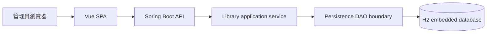
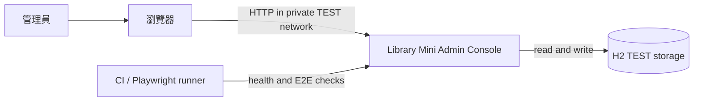
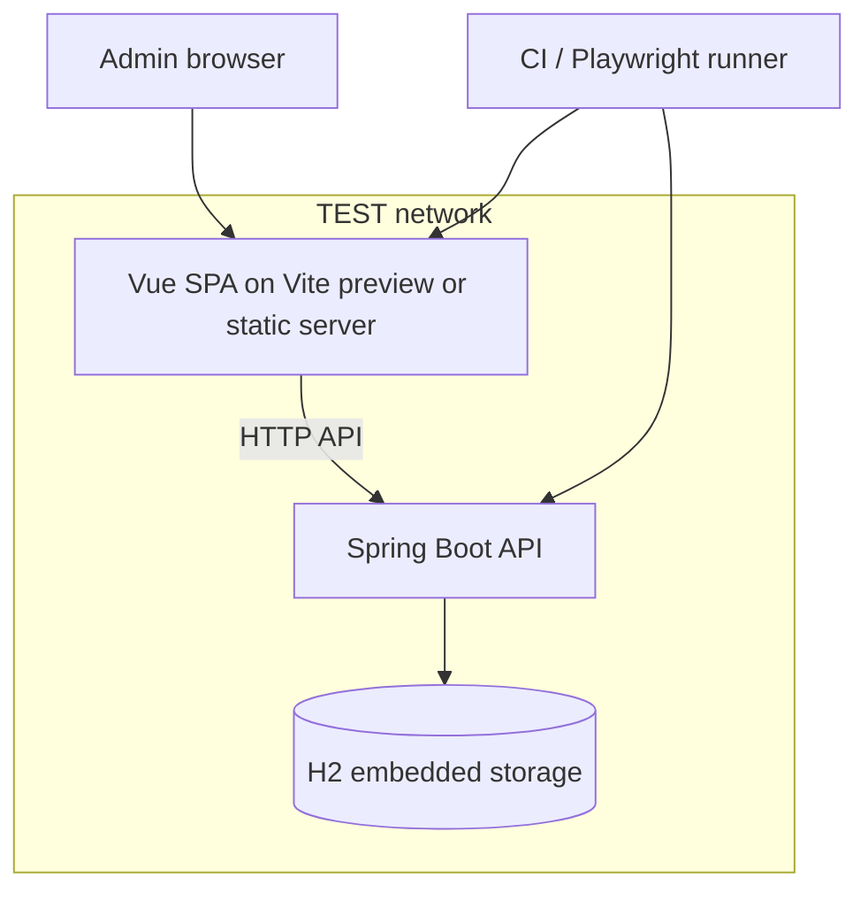

# ARCH-LIB-001 系統架構（Archi）

## 1. 文件目的與範圍

- 需求來源：docs/requirements/REQ-LIB-001.md
- 場景 / workflow：SCN-LIB-001；docs/workflows/WF-LIB-001.md
- 架構目標：在 TEST profile 建立可重複驗證的小型圖書櫃管理系統，支援新增書籍、借出、歸還、館藏查詢與庫存一致性。
- 文件範圍：系統層元件、環境拓撲、技術選型、信任邊界、控制面、NFR 取捨及 SD handoff。
- 不含範圍：API contract 細節、DTO、response envelope、資料表欄位／DDL、SQL、transaction step-by-step、lock implementation、程式碼與模組內 package layout。
- 文件狀態：Ready for SD

### 1.1 標準環境 profile 對應

標準 profile 定義以 `.codex/skills/architecture-planner/references/architecture-template.md` 的 `1.1 標準環境 profile 對應表` 為唯一來源。本次只選用 `TEST`；不建立或模擬 PROD 拓撲。

### 1.2 本專案實際環境與需求確認

| 實際環境名稱 | 對應 profile | 是否納入 | 目的與成功條件 | 使用者確認狀態 |
| --- | --- | --- | --- | --- |
| test | TEST / QA | 是 | 執行功能、回歸與 smoke E2E；前後端可啟動、資料可重置、REQ-LIB-001 的 AC 可重複驗證。 | Confirmed |
| local | LOCAL | 僅本地運行 | 開發者快速回饋與測試準備；不視為部署或 release promotion 環境。 | Assumed |

### 1.3 假設、問題與追蹤

| ID | 假設 / 待確認問題 | 為何影響架構 | 狀態 | 信心 | 負責人／驗證點 |
| --- | --- | --- | --- | --- | --- |
| A-001 | 使用者確認本次只需要 TEST；local 只保留作為 repo 的開發啟動模型。 | 決定不建立 UAT、SIT、PROD HA／DR 拓撲，也限制本文件的營運承諾。 | Confirmed | High | 產品／Archi；本文件環境矩陣 |
| A-002 | MVP 免登入；任何可進入隔離 TEST 網路的呼叫者都視為管理員。 | 決定信任邊界以網路隔離為主，且本版本不能暴露於公開網路。 | Confirmed | High | 產品／Archi；TEST ingress 與安全檢查 |
| A-003 | MVP 使用 H2 2.3.232；TEST 以 embedded file-backed database 運行，測試資料可由 seed 重建。 | 避免外部 DB 服務與網路依賴，但限定單實例與 TEST-only 使用。 | Assumed within user-approved option | Medium | SD／BE；POM、啟動與重置驗證 |
| A-004 | TEST 僅使用 synthetic 或嚴格遮罩的讀者資料，不使用真實姓名、讀者 ID 或 production data。 | 讀者識別值可能是個人資料；決定 TEST 的資料保護與 log redaction 邊界。 | Assumed | Medium | QA／CI owner；fixture review |
| A-005 | TEST 為低流量、低併發品質環境；REQ 的 2 秒畫面回饋目標適用於正常測試負載。 | 可採單實例、無 cache、嵌入式 DB；超出負載時需升級拓撲。 | Assumed | Medium | Archi／PG／QA；性能 smoke |
| A-006 | 逾期罰款、reader identity 欄位、ISBN／作者必填性與 ISBN-only 歸還仍依 REQ Q-001 至 Q-004 由 SA／SD 定案。 | 會影響 schema、API contract 與前端流程，但不改變本次單服務拓撲。 | TBD | N/A | SA／SD；REQ 與 SD artifacts |

本次 readiness decision matrix：

| Decision area | 結果 | 依據或限制 |
| --- | --- | --- |
| Environment | Confirmed | 使用者指定 `test`；local 僅為開發運行模型。 |
| Users and access | Confirmed | 使用者指定 MVP 免登入；隔離 TEST 網路內視為 admin。 |
| Data protection | Assumed | synthetic／masked data、H2 TEST storage；無 PROD data 或 production secret。 |
| Availability | Not applicable | 本次沒有 PROD；TEST 不承諾 business SLO，僅要求可重跑品質閘門。 |
| Load and efficiency | Assumed | 小型資料集、低併發、REQ-NFR-003 的 2 秒 UI 目標。 |
| Consistency and cache | Confirmed | 借閱庫存需 read-after-write 一致；不採 cache。 |
| Dependencies | Confirmed | 無 runtime third-party dependency；Figma 只作設計來源，H2 為 embedded persistence。 |
| Operations | Assumed | CI／TEST log 與報告由 repo／CI owner 維護；無 24x7 on-call。 |
| Delivery and cost | Assumed | 以 repo 的 Maven／npm／Playwright gates 發布到 TEST；不包含 cloud hosting budget。 |

## 2. 技術選型與版本治理

| 領域 | 選定技術／版本 | 版本固定與變更規則 | 選擇理由 | 替代方案與取捨 |
| --- | --- | --- | --- | --- |
| Frontend runtime | Vue 3.5.28、Vite 7.3.1、TypeScript 5.9.3、Node 20.19 或 22.12 以上 | `package-lock.json` 納入版本控制；release build 使用 lockfile；升級需通過 lint、type-check、build、Playwright。 | 符合現有 `apps/web/library-mini-admin-web` 基線與 Figma UI 轉譯需求。 | React 或 Angular 會增加移植成本；本情境沒有切換理由。 |
| Backend runtime/framework | Java 21、Spring Boot 3.5.12-SNAPSHOT | POM 已指定 Java 21 與 Spring Boot 版本；TEST 可沿用目前 snapshot，但若進入 UAT／PROD 必須改為已發布且固定的 Spring Boot 版本。 | 符合現有 `pom.xml` 與 repo 既有 Java baseline。 | 升級至已發布版本可降低 snapshot 風險，但不屬於本 TEST MVP 的必要範圍。 |
| Build/tooling | Maven Wrapper 3.3.4、Maven distribution 3.9.12、`pom.xml` | Wrapper properties、POM plugin 版本與 dependency lock 需 reviewable；CI 使用 wrapper，不依賴 runner 全域 Maven。 | 現有 wrapper 已提供可重複建置入口。 | 系統 Maven 會造成 runner 漂移，不採用。 |
| API contract generation | OpenAPI Generator Maven plugin 7.25.0、`docs/openapi.yaml` | plugin 版本固定於 POM；OpenAPI contract 另行版本控制；generated API code 必須提交 Git 且不得手動編輯。 | repo 已有 `api-generation` profile，符合 FE／BE 平行交接需要。 | 手寫 controller contract 會造成 API drift，不採用。 |
| Persistence | H2 Database Engine 2.3.232，透過 JDBC 存取；TEST 使用 embedded file-backed storage | H2 版本固定；資料位置不可指向 production；TEST reset／seed 流程需可重複執行；升級需通過 migration、API、E2E checks。 | 使用者允許 SQLite 或 H2；H2 與 Java／JDBC／Liquibase 整合成本較低，且不需額外 DB service。版本可參考 [Maven Central H2 artifact](https://central.sonatype.com/artifact/com.h2database/h2/2.3.232)。 | SQLite 也低成本，但 Java driver、migration 相容性與多執行緒寫入行為需另行驗證；PostgreSQL 適合 production，但超出 TEST MVP。 |
| Database migration | Liquibase formatted SQL | changeset immutable；只允許 formatted SQL；Liquibase XML 禁止；migration 需在 TEST 啟動與 CI gate 驗證。 | repo 的 backend workflow 已規範此治理方式，且能保留 schema 演進軌跡。 | 手動 SQL 或 XML changelog 會降低一致性，不採用。 |
| Messaging | N/A | 不引入 MQ、outbox、dead-letter 或非同步 delivery。 | 本情境是同步新增／借出／歸還，沒有跨服務事件需求。 | RabbitMQ／Kafka 會增加部署、重試與一致性複雜度；當事件通知成為需求時再評估。 |
| Runtime observability | Spring Boot Actuator、structured stdout logs、CI artifacts | actuator endpoint 與 log schema 需固定於 TEST 設定；不將 debug secret 或完整讀者資料寫入 log。 | 現有 POM 已含 actuator，足以支援 TEST health 與品質檢查。 | 引入完整 APM／集中式商用平台會增加 TEST 成本，暫不採用。 |

版本治理補充：現有 frontend `package.json` 使用部分 semver range，實際 TEST 版本以 committed lockfile 為準；SD／PG 不得透過未鎖定依賴造成環境漂移。現有 Spring Boot snapshot 只限 TEST，任何超出 TEST 的 promotion 都必須先完成 release version review。

## 3. 應用架構選型與依賴方向

- 選定模式：三層式 `controller -> service -> dao`，以同步 HTTP request／response 完成所有本情境用例。
- 複雜度訊號：目前只有一個 library domain、一個 embedded persistence、無外部 runtime integration、無 MQ、無跨服務交易；主要複雜度集中在庫存不變量、借閱紀錄定位與重複提交防護。
- 主要邊界與依賴方向：Browser／Vue SPA 呼叫 generated API boundary；controller 只負責 transport translation；service 負責用例與業務不變量；dao 負責 persistence boundary；H2 僅由 dao／persistence adapter 使用。依賴方向不可由 service 反向依賴 Vue 或 HTTP。
- 若有 MQ：N/A，本架構不使用 MQ。
- 交易、delivery、retry、dead-letter、ordering、idempotency 與 consistency 考量：所有寫入用例保持同步並在單一 persistence boundary 內完成一致性；FE 送出期間停用按鈕，BE／SD 仍需定義重複請求與併發版本衝突的可測試行為；因沒有 MQ，不需要 delivery、dead-letter 或 ordering topology。
- 選擇理由：三層式架構足以承載本次小型、單邊界、同步 MVP，同時保留 service 層作為借出／歸還庫存規則的單一入口。
- 未採用替代方案與原因：不採 Clean／Hexagonal full structure，因目前沒有多個替換式 adapter 或外部整合；若未來切換 PostgreSQL、導入認證、通知或多服務，再將 persistence／identity／event port 抽出。

```mermaid
flowchart LR
    browser[管理員瀏覽器]
    spa[Vue SPA]
    api[Spring Boot API]
    service[Library application service]
    dao[Persistence DAO boundary]
    h2[(H2 embedded database)]
    browser --> spa --> api --> service --> dao --> h2
```

## 4. 架構決策與取捨

### 4.1 關鍵決策

| ID | 決策 | 選項與取捨 | 需求依據 | 影響 / 後續觸發條件 |
| --- | --- | --- | --- | --- |
| ADR-001 | 本次 deployment scope 限定 TEST，local 僅作開發運行。 | 成本與可重現性優先；不承諾 PROD 可用性、HA 或 DR。 | User decision 1；REQ NFR-003、NFR-005 | 若需要正式業務運作，必須新增 UAT／PROD profile、SLO、RTO、RPO 與運維 owner。 |
| ADR-002 | 選 H2 2.3.232 作為 embedded persistence。 | 比 SQLite 更貼合 Java/JDBC 與 Liquibase；代價是不能直接視為 production database，且單實例寫入能力有限。 | User decision 3；REQ Q-005、NFR-001 | 出現多實例、跨部署持久化、寫入 contention 或正式資料政策時切換 PostgreSQL 等 server DB。 |
| ADR-003 | 使用單一 Spring Boot API + Vue SPA，所有流程同步完成。 | 部署與除錯簡單；不具備獨立服務擴展與非同步事件能力。 | FR-001 至 FR-005；REQ Out-of-scope | 若增加通知、搜尋索引、外部 catalog 或跨服務流程，再引入明確 adapter／event boundary。 |
| ADR-004 | 三層式 controller、service、dao；業務規則集中於 service。 | 足夠支援當前 domain；比 full Clean／Hexagonal 輕量，但跨多資料源時需再抽象。 | REQ BR-003 至 BR-008；NFR-001 | 多資料源、外部 identity 或多服務整合出現時升級為 Ports and Adapters。 |
| ADR-005 | MVP 不登入，安全依賴 TEST 網路隔離與資料政策。 | 開發速度快；任何取得 TEST 網路入口者具備管理能力，不能暴露到 public ingress。 | User decision 2；REQ Q-008 | 任何非 TEST 使用、敏感資料或正式部署需求都必須先導入 OIDC／SSO、RBAC 與 audit policy。 |
| ADR-006 | 不使用 cache，直接讀 H2。 | 保證小資料集的 read-after-write freshness；以少量資料換取低成本與一致性。 | REQ NFR-001、NFR-003；FR-004 | 查詢量、延遲或資料量超出 threshold 時，先量測再評估 read cache 與明確 invalidation。 |
| ADR-007 | TEST observability 以 Actuator、structured log、CI evidence 為主。 | 足以驗證品質；沒有 24x7 APM、集中式 audit store 或 production on-call。 | REQ NFR-004；TEST profile | 若導入 PROD 或合規 audit，需外接集中式 telemetry、不可竄改 audit storage 與 on-call。 |

### 4.2 主要取捨

- 成本：embedded H2、單一 API、Vue static／preview server 與 CI runner 不需要 managed database、MQ 或 APM 平台，TEST 成本最低。
- 複雜度：把 domain 一致性留在單一 service／persistence boundary；不引入 CQRS、SAGA、event sourcing、microservices 或 MQ。
- 可用性／可靠性：TEST 採單實例；服務故障可重啟，資料可由 synthetic seed 重建。這適合品質測試，不適合共享正式業務。
- 安全性／維運性：免登入降低 MVP 操作成本，但必須用 private TEST ingress、無 production data、CI secret isolation 與 network boundary 補償；此方案不可直接 promotion 為 PROD。

## 5. 系統脈絡（C4-L1）

### 5.1 描述

- 使用者與角色：管理員透過瀏覽器執行新增書籍、借出、歸還與查詢；MVP 不登入，TEST trust boundary 內的呼叫者皆被視為 admin。
- 外部系統：無 runtime third-party system。Playwright／CI runner 是測試與發布控制系統，不是業務依賴；Figma export 是設計輸入，不參與 runtime。
- 信任邊界：瀏覽器與 TEST application network 之間為 client boundary；Vue SPA 與 Spring Boot API 位於隔離 TEST network；H2 與 API 同一 runtime／storage boundary；CI runner 另有 pipeline control boundary。
- 重要資料／控制流：管理員輸入書籍與讀者識別資料，SPA 經 HTTP 呼叫 API，API 讀寫 H2 並回傳最新館藏狀態；每次交易產生 correlation／business outcome evidence。TEST 只允許 synthetic／masked data。

### 5.2 Mermaid

```mermaid
flowchart LR
    admin[管理員]
    browser[瀏覽器]
    system[Library Mini Admin Console]
    db[(H2 TEST storage)]
    ci[CI / Playwright runner]
    admin --> browser
    browser -->|HTTP in private TEST network| system
    system -->|read and write| db
    ci -->|health and E2E checks| system
```

## 6. 容器視圖（C4-L2）

### 6.1 描述

| 容器 | 職責 | 所有者 | 邊界／主要依賴 |
| --- | --- | --- | --- |
| Vue SPA | 呈現 Figma 對齊的 TopBar、交易表單、館藏表格、loading／error／success 狀態；集中 typed API access 與穩定 `data-testid`。 | FE | 只依賴 Spring Boot API contract；不直接存取 H2。 |
| Spring Boot API | 提供書目、借出、歸還與查詢能力；執行 business code mapping、庫存不變量與 request correlation。 | BE | 依賴 generated OpenAPI boundary、service layer、H2 persistence boundary、Actuator。 |
| H2 embedded database | TEST-only persistence；保存書目、借閱狀態與必要的測試交易資料。 | BE／TEST owner | 僅由 API persistence boundary 存取；資料可 reset，禁止接 production data。 |
| CI／Playwright runner | 啟動或連接 TEST application，執行 health、build、contract、smoke E2E 與產出 evidence。 | QA／CI owner | 依賴 frontend、backend 可達性與 synthetic fixture；不是 runtime business container。 |

### 6.2 Mermaid

```mermaid
flowchart TB
    runner[CI / Playwright runner]
    browser[Admin browser]
    subgraph test[TEST network]
        web[Vue SPA on Vite preview or static server]
        api[Spring Boot API]
        db[(H2 embedded storage)]
        web -->|HTTP API| api
        api --> db
    end
    browser --> web
    runner --> web
    runner --> api
```

## 7. 部署拓撲與本地運行模型

### 7.1 系統部署拓撲

- 網路區域與 ingress／egress：TEST 由 private CI runner、localhost 或 private test ingress 提供入口；frontend 預設沿用 repo 的 5173 本地 dev port，CI preview 使用 4173；backend 沿用 repo 的 8080 服務邊界。不得開放 public ingress；runtime 不需要對外 egress。
- 失效域與擴展邊界：TEST 只有一個 application instance 與同機 H2 storage；frontend／backend／H2 同一測試執行邊界，沒有跨 zone failover。任何第二個 API instance 都必須先改用 server DB 並重新驗證一致性。
- 託管服務與責任分界：本次沒有 managed service；CI runner、Node、JDK、Maven wrapper、H2 file 與測試 artifacts 由 CI／repo owner 負責。
- 外部依賴失效時的隔離／降級：沒有 runtime third-party dependency；若 API 不可達，SPA 顯示 loading／system error，不能使用 stale inventory 偽裝成功；CI health gate fail。TEST 的 CORS 可依 SD 的 test shortcut 處理，不形成 production policy。

### 7.2 各環境部署矩陣

| 面向 | test（TEST） |
| --- | --- |
| 網路區域／ingress／egress | private CI／localhost；frontend 5173 或 4173；backend 8080；禁止 public ingress；無 runtime external egress。 |
| 拓撲／執行個體／HA | Vue preview／static server + 一個 Spring Boot API + 同機 H2；無 HA、無 replica、無跨 zone failover。 |
| 外部依賴（real／sandbox／stub／mock） | 無 runtime third-party dependency；Figma 為離線設計來源；Playwright／CI 為 test control dependency。 |
| scaling／failure domain／maintenance | 小型低併發；人工或 CI job restart；H2 storage 與 API 共用 failure domain。 |
| deploy／promotion／rollback | PR／CI gates 通過後部署 TEST；rollback 使用前一個可驗證 build，資料以 synthetic seed reset；不 promotion 至 UAT／PROD。 |
| 成本護欄 | 不採 managed DB、MQ、APM 或多副本；只使用 CI runner、JDK、Node 與 repo artifacts。 |

### 7.3 本地運行模型

- 啟動方式與必要依賴：`npm run setup` 後，使用 `npm run dev` 同時啟動 backend 與 frontend；也可使用 `npm run dev:api` 及 `npm run dev:web` 分別啟動。backend 需使用 Java 21 與 Maven Wrapper 3.9.12；frontend 需符合 package engines。H2 與 migration 依 BE／SD 實作後由 backend 啟動初始化。
- 本地替身／測試資料政策：使用 synthetic seed，禁止從 TEST 或 PROD 複製資料；每個 E2E run 建立可識別的測試資料並在結束後 reset 或清理。
- 與各環境的差異及不可模擬項：local 可使用 H2 in-memory 或 local file 快速迭代；test 使用受控、可重建的 H2 file-backed data；local／test 都不能模擬正式 HA、server DB failover、SSO、DR 或 production traffic。

## 8. NFR 與架構控制面

本章是安全與維運控制面的唯一內容來源；部署矩陣只引用本章的決策。

### 8.1 Requirements readiness and NFR 對應

| NFR／需求 ID | 目標或約束摘要 | 詳細控制面章節 | 驗證證據／owner | 狀態 |
| --- | --- | --- | --- | --- |
| FR-001 至 FR-005 | 新增、借出、歸還、館藏查詢及交易回饋 | 3、6.1、8.5 | SD contract、BE tests、FE tests、QA | Pass，architecture constraint |
| FR-UI-001 | Figma UI 對齊、responsive layout、stable `data-testid` | 6.1、8.6 | Figma source、FE check、QA locator review | Pass，architecture constraint |
| NFR-001 | 庫存與借閱紀錄一致，不可負數或超過總數 | 3、4.1 ADR-004、8.5 | service／persistence consistency tests | Pass，SD／BE detail pending |
| NFR-002 | labelled form、keyboard、disabled、窄螢幕可用 | 6.1、7.3 | FE accessibility check、Playwright | Pass，FE implementation pending |
| NFR-003 | 正常 TEST 負載下 2 秒內反映結果 | 4.1 ADR-006、8.6 | Playwright timing evidence | Pass，QA measurement pending |
| NFR-004 | business code、correlation、structured log、可追蹤交易 | 8.2、8.3、8.4、8.7 | API／log／CI artifact review | Pass，SD mapping pending |
| NFR-005 | TEST／local 的現代瀏覽器與窄螢幕支援 | 2、7.2、7.3 | FE build、Chromium／Firefox／WebKit smoke | Pass，QA execution pending |

### 8.2 存取控制與安全

- 人員／service identity 與 authentication：依使用者確認，MVP 不登入；TEST 呼叫者不建立 application identity。CI runner identity 由 CI 平台控制，使用短期 job permission；Figma export 不提供 runtime credential。
- authorization、RBAC／ABAC、least privilege：MVP 只存在單一管理員能力，不做 RBAC／ABAC；API 只在 private TEST boundary 提供管理能力，未知 route／method 仍 deny by default。若入口離開 private TEST，這項決策視為不合格，不得部署。
- tenant／environment／network isolation：TEST 使用獨立 H2 storage、獨立 CI secrets、獨立 telemetry artifacts；不讀取 production network、bucket 或 database；local config 不得包含 TEST credential。
- secrets、key ownership、rotation：本 MVP 沒有 runtime secret；若 CI 需要 access token 或 private ingress credential，放入 CI secret store，不進 Git／log；CI owner 負責 rotation 與 revoke。
- privileged／admin／break-glass access：application break-glass 不適用；H2 file、CI variables、TEST ingress 的 privileged access 由 repo／CI owner 控制並記錄。任何人工直接修改 H2 只允許在隔離測試資料修復流程，禁止作為業務操作。
- access review、revocation、deny-by-default：每次 CI run 使用短期 runner permission；失效或取消 job 即撤銷；shared TEST 若日後開放，必須先補 OIDC／SSO、admin RBAC、review、revocation 與 MFA decision。

### 8.3 可追蹤性與 auditability

- correlation／request ID 與 distributed trace ID 傳遞：每個 API request 在 ingress 產生或接受 correlation ID；前端錯誤回饋、backend log、CI evidence 均保留該 ID。沒有跨服務 runtime，distributed trace ID 只作可選相容欄位；若日後新增服務，沿 HTTP boundary 傳遞 W3C trace context。
- 必須 audit 的安全與業務動作：新增書籍、借出、歸還、交易拒絕、資料 reset、migration／startup failure 與 privileged TEST operation。
- audit event 最低內容：actor（MVP 使用 `mvp-admin`，CI 使用 runner identity）、target、action、timestamp、outcome、reason／source、environment、correlation ID、build／commit identity；不記錄完整 secret 或不必要的讀者明文。
- 儲存、不可竄改性、存取權限、保留與隱私：TEST audit 以 structured log／CI artifact 保存，不宣稱不可竄改；artifact 依 CI retention policy 保存，預設採 14 天假設，並可由 QA evidence 下載；讀者 fixture 使用 synthetic／masked 值。正式 audit store、不可竄改與長期 retention 不在本次 scope。
- 如何回連需求、部署版本與 incident：每個 run artifact 綁定 scenario、requirement、workflow、commit／build identity；CI failure 連回 failed job 與 `README.md#quick-start`／`README.md#commands-reference`，後續 issue 使用 correlation ID 與 build identity 查找。

### 8.4 Logging

- structured／centralized logging：backend 以 JSON 或等效 key-value structured stdout log；TEST CI 收集 stdout 為 job artifact，必要時由 CI 平台集中查詢；frontend console 僅記錄非敏感 client error。
- log 類別、severity、timestamp、correlation 欄位：startup／shutdown、request outcome、business action、validation rejection、persistence failure、health／migration failure；使用 INFO、WARN、ERROR；timestamp 統一 UTC；每筆交易 log 帶 correlation ID、environment、build identity。
- PII／secret redaction、sampling、retention：禁止 token、password、DB credential；reader name／ID 使用 synthetic 或遮罩值；正常 TEST request 不 sampling，DEBUG 不預設開啟；artifact 預設保留 14 天假設，CI owner 可調整。
- log pipeline 失效時的行為：業務交易不依賴外部 log collector 才能完成；服務保留 local stdout；CI 若無法保存 evidence，quality gate 標為 incomplete，不能宣稱 observability pass。
- operational log 與 audit record 的責任區分：operational log 用於除錯、健康與效能；audit event 用於新增／借出／歸還與 privileged test action。兩者都須 redaction，TEST 不把 log-based audit 誤稱為 production tamper-proof audit。

### 8.5 Availability、HA、resilience 與 recovery

- availability target／SLA／SLO：TEST-only，無 business availability SLA／SLO；成功標準是 CI 可啟動服務並完成 health、build、API 與 smoke E2E gates。
- failure domain、replica、health/readiness、failover：一個 TEST application instance、同機 H2；Actuator health／readiness 作為 CI preflight；無 HA、replica 或 automatic failover。
- timeout、retry／backoff、rate limit、graceful degradation：前端以 REQ 2 秒回饋目標量測；沒有 runtime external dependency，因此不設 dependency retry；寫入不可由無條件 retry 造成重複交易，SD 需定義可驗證的 idempotency／conflict 行為；shared TEST 入口可由 network／CI 限流，application rate limit 不在 MVP 必要範圍。
- dependency isolation：H2 與 API 同一 boundary；沒有 external runtime dependency。API 不可用時 frontend 顯示 error，不使用 stale inventory 來冒充成功。
- backup／restore、RTO、RPO、DR：正式 backup／DR 不適用 TEST；H2 file 可由 synthetic seed rebuild。測試 workspace 的 operational recovery 目標暫定 15 分鐘內重建，允許遺失所有 TEST data；此為 TEST convenience target，不是 business RTO／RPO。
- maintenance 與 recovery drill 頻率：每次 release candidate 至少執行一次 clean start、migration、seed、smoke；CI failure 以 `README.md#quick-start` 重啟，無 24x7 on-call。
- lower-tier 的刻意降級與 PROD gate：TEST 單實例、無 HA、無登入、無 formal DR 是刻意降級；任何 PROD request 必須新增已確認 SLO、RTO／RPO、backup、DR、identity、audit 與 on-call，不能直接沿用本架構。

### 8.6 效能、存取效率與 cache

- latency／throughput／concurrency 目標：以 REQ-NFR-003 為 UI 目標，正常 TEST 負載下新增／借出／歸還的結果在 2 秒內反映；容量假設為小型館藏與低併發，實際數值由 QA benchmark 記錄。
- 預期瓶頸與量測方式：瓶頸預期為 H2 file write、單實例 CPU／memory、網路啟動與 Vite preview；用 Playwright timing、API request metrics 與 CI runtime 測量，不以 CPU 單指標判斷品質。
- cache 是否必要及適用資料：不需要 cache；館藏數量與借閱狀態需要 read-after-write freshness，資料集小且 H2 read cost 足低。
- scope、TTL／freshness、invalidation／versioning：N/A；不建立 cache、TTL 或 invalidation contract。
- consistency、stampede／poisoning、sensitive-data policy：N/A；無 cache 因而無 stale、stampede、poisoning 或 cache sensitive-data exposure。
- capacity／eviction、cache outage fallback：N/A；H2 storage capacity 由 TEST workspace 管理，storage failure 走 B0000／system error 與 CI failure。
- hit／miss、staleness、eviction metrics：N/A；若未來加入 cache，必須先定義 hit／miss、staleness、eviction 與 invalidation owner。

### 8.7 Monitoring、dashboard 與 alerting

- metrics、logs、traces、audit、synthetic／dependency checks：Actuator health、HTTP request count／latency／error、H2 connectivity／startup、migration status、structured logs、business audit events；Playwright 執行 browser synthetic journey；無 MQ／cache metrics。
- traffic、latency、errors、saturation、availability／SLO：TEST dashboard／CI summary 顯示 request volume、p50／p95 latency、4xx／5xx or business error ratio、JVM／process memory、H2 storage availability、test pass rate；availability 以 health／smoke gate 表示而非 business SLO。
- dependency、queue／storage、cache、security、business metrics：dependency runtime N/A；監控 H2 file／workspace capacity；queue／cache N/A；security signal 為未授權 ingress attempt 或 credential scan；business metrics 為新增、借出、歸還成功／拒絕次數與庫存 invariant failure。
- dashboard audience 與 ownership：QA／FE／BE／repo owner 使用 CI summary 與 test artifacts；CI owner 維護 pipeline retention；Archi 不承擔 24x7 dashboard on-call。
- alert condition、severity、routing、on-call、escalation：health endpoint failure、migration failure、smoke failure、OpenAPI generate／verify failure為 high，直接使 CI job fail 並路由至 PR／CI owner；持續 business invariant failure 為 high 並建立 issue；一般 validation rejection 不 alert。沒有 24x7 escalation，工作時段由 repo owner 處理。
- deduplication／noise control、runbook、response expectation：同一 CI run 只保留一次 root failure，retry 不重複建立 issue；先查 failed job、correlation ID、build identity，再依 `README.md#quick-start` 重啟或依 `README.md#commands-reference` 執行 gate；TEST failure 預期於下一個工作時段處理。

## 9. 成本與複雜度控制

- 各環境 profile 的成本護欄與代表性取捨：只建立 TEST，使用單 instance、H2、CI runner 與 synthetic data；local 不視為付費環境；不建立 UAT／SIT／PROD 資源。
- PROD 成本驅動因素：本次沒有 PROD；若後續需要，主要驅動為 server DB、HA replicas、private ingress、OIDC／SSO、central telemetry、backup／DR、on-call 與 data retention。
- 為何不採用更複雜方案：沒有 MQ、microservices、CQRS、SAGA、event sourcing、distributed cache 或 managed database 的需求；這些方案會增加一致性、部署與維運成本，不能由本 scenario 合理化。
- 擴容／升級觸發條件：需要多個 API instance、資料在 deployment 後仍須保留、H2 write contention、超出 2 秒目標、TEST 轉共享正式業務、引入真實讀者資料、需要登入／audit／DR 或外部 integration 時，停止沿用本 TEST topology，重新進行 Archi review。

## 10. 風險、非目標與開放決策

| ID | 風險／非目標／未決策 | 影響 | 緩解或需要的決策 | Owner / deadline |
| --- | --- | --- | --- | --- |
| R-001 | 免登入若被部署到 public ingress，任何呼叫者都具備 admin 能力。 | 高；可能造成未授權借閱、資料修改與讀者資料暴露。 | TEST 只允許 private ingress；任何 UAT／PROD 必須先導入 OIDC／SSO、RBAC、MFA 與 audit review。 | Archi／SD／PG；promotion 前 |
| R-002 | H2 embedded database 不適合 multi-instance 或正式長期資料。 | 高；可能有 file locking、write contention、資料遺失與無法 HA。 | 限定 TEST；以 synthetic seed rebuild；觸發條件到達時切換 server DB 並重新做 migration／recovery design。 | Archi／SD；拓撲變更前 |
| R-003 | Figma 還書流程以 ISBN 可能無法唯一定位多複本借閱。 | 中高；可能錯誤結束借閱紀錄。 | SD 將 return command 約束為唯一 loan identity；SA／SD 定案 Q-004，FE 保留 stable locator。 | SA／SD／FE；OpenAPI freeze 前 |
| R-004 | 現有 Spring Boot 3.5.12-SNAPSHOT 不是正式 release baseline。 | 中；建置可能受 snapshot repository 或相容性影響。 | TEST 先沿用現有 POM pin；promotion 超出 TEST 前改用 released pinned version。 | BE／PG；promotion 前 |
| R-005 | 現有 frontend 是 Vue starter，Figma export 是 React/TS Make snapshot。 | 中；直接移植可能造成 UI、locator 或互動落差。 | FE 以 Vue 3.5.28 實作，Figma 作視覺語意基準；以 AC-UI-001 與 data-testid review gate 驗證。 | FE／QA；S5A |
| R-006 | reader name／ID、due date／fine、author／ISBN 必填性尚未完全定案。 | 中；影響 schema、API 與驗收，但不改變本次單服務拓撲。 | 保留 REQ Q-001 至 Q-003；SD 不自行擴大業務範圍，必要時回送 SA。 | SA／SD；S3 |
| R-007 | TEST log／audit artifact 不是不可竄改的正式 audit store。 | 中；不適合合規稽核或長期追責。 | 僅限 synthetic TEST；正式需求觸發時導入集中式 immutable audit storage 與 retention policy。 | Archi／Security；正式環境前 |
| R-008 | 本次不包含 UAT／SIT／PROD promotion。 | 中；無法宣稱正式可用性、DR 或 business continuity。 | workflow 保持 S3 handoff，不建立未授權環境；後續需求需重新確認 profiles。 | Orchestrator／Product；scope change 時 |

## 11. 移交 SD 項目（Archi 不定稿）

1. 依 REQ-LIB-001 的 FR／AC 與 API ID 候選產出 OpenAPI contract；定稿 operation path、Request／Response DTO、business error response envelope，並遵守 AGENTS.md 命名與 `00000`／`A0000`／`B0000`／`C0000` 規則。
2. 定義 H2 2.3.232 的 persistence integration、Liquibase formatted SQL migration、TEST seed／reset policy；不得在本文件反向推導資料表欄位或 DDL。
3. 將庫存不變量、借出／歸還一致性、重複提交、併發版本衝突與唯一 loan identity 轉成可測試的 service／API flow 約束；Archi 只要求一致性邊界，不定稿 SQL、lock 或 transaction steps。
4. 依 TEST topology 定義 frontend 5173／4173 與 backend 8080 的 environment config、CORS test shortcut、health／readiness exposure 與 failure mapping；不得把 permissive TEST CORS 變成 production policy。
5. 定義 generated OpenAPI interface 的 POM integration；維持 plugin 7.25.0 pin、generated source commit、禁止手動修改與 `api:generate`／`api:verify-generated` gates。
6. 定義 API correlation ID、business error code、structured log、audit event 最低資料與 PII／secret redaction；保留對應 REQ、workflow、commit／build identity 的 traceability。
7. 與 FE／PG 凍結 Figma-aligned UI、Vue implementation boundary 與 `data-testid` locator contract；不可移除或任意更名既有 locator，新增 locator 需記錄於 task／QA handoff。
8. 定義 TEST E2E fixture isolation、synthetic data、H2 reset／cleanup 與 CI artifact retention；將健康檢查、migration、smoke 與 REQ AC 納入 S3／S4 gate。
9. 若 Q-001 至 Q-004 未在 SD freeze 前解決，列為 SD blocker 並回送 SA／產品，不以架構文件中的 assumption 代替需求決策。

## 12. 擴展觸發條件（後續）

- 流量／latency／storage／cache 指標達到：TEST dataset 或 concurrency 使 REQ 的 2 秒目標連續失敗，或 H2 workspace／write contention 成為主要瓶頸。
- 可用性、RTO／RPO 或 failure drill 不再滿足：需要跨部署資料保留、multi-instance、HA、正式 backup／restore 或 business continuity。
- 權限、audit、合規或資料區域要求改變：需要真實讀者資料、SSO／MFA、RBAC、immutable audit、長期 retention 或 residency control。
- 外部依賴 SLA／成本／風險改變：引入 catalog、notification、identity、payment 或任何需要 retry／outbox／MQ 的 runtime dependency。

## 13. 完成檢查與證據

| 檢查項目 | 結果 | 證據／備註 |
| --- | --- | --- |
| 需求與使用者確認可追蹤 | Pass | REQ-LIB-001；本次使用者確認 TEST、免登入、H2／SQLite option；本文件 A-001 至 A-006。 |
| 實際環境到 profile 的對應與部署矩陣完整 | Pass | 1.2、7.2；實際 deployment 只有 test，local 為 run model。 |
| C4-L1／C4-L2／deployment topology | Pass | 5.2、6.2、7.1。 |
| 存取控制與 secrets | Pass | 8.2；免登入限於 private TEST，無 runtime secret，promotion gate 明確。 |
| correlation／trace／auditability | Pass | 8.3；單服務無跨服務 trace，audit 以 TEST structured artifact 實現。 |
| logging | Pass | 8.4；structured stdout、redaction、retention assumption、pipeline failure behavior。 |
| HA／resilience／RTO／RPO／DR | Pass | 8.5；TEST 不適用 business SLO，15 分鐘 rebuild 是明示的 operational convenience target。 |
| 效能與 cache 或 no-cache rationale | Pass | 8.6；2 秒目標、低併發假設與 no-cache rationale。 |
| monitoring／dashboard／alerting | Pass | 8.7；metrics、CI dashboard、owner、severity、routing、escalation 與 runbook。 |
| SD handoff 與 Archi 邊界 | Pass | 11；未定稿 API、DTO、schema、DDL、SQL、lock、transaction steps。 |
