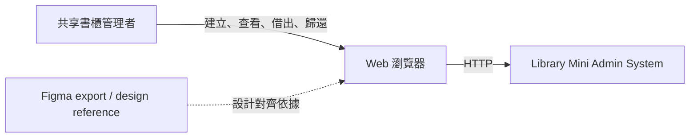
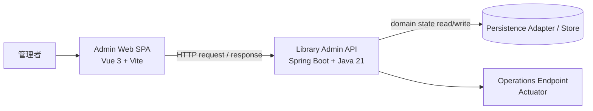

# ARCH-LIB-001｜小型圖書櫃管理 MVP 系統架構

## 1. 文件目的與範圍

- 需求來源：`docs/requirements/REQ-LIB-001.md`（來源情境：`SCN-LIB-001`）。
- 架構目標：以最小可運行的 Web 系統支援書籍建立、館藏狀態查看、借書、還書與業務結果回饋。
- 文件範圍：系統層架構，包含 C4-L1/L2、部署拓撲、執行假設、NFR 策略、成本與風險取捨。
- 不含範圍：API contract、DTO、錯誤碼欄位映射、資料庫 schema／DDL／index，以及交易步驟；這些交由 SD 定稿。
- 架構狀態：Archi MVP baseline；`REQ-LIB-001` Q-001～Q-005 的業務決策仍需在 SD contract freeze 前確認。

## 2. 架構決策與取捨

### 2.1 關鍵決策

1. 採單一 Web 應用邊界：瀏覽器中的 Vue SPA 搭配單一 Spring Boot API，避免 MVP 引入微服務、訊息佇列或 API Gateway。
2. 前後端分離部署但保留本地一鍵啟動模型。前端負責 Figma 對齊與互動狀態，後端負責館藏與借閱業務的唯一狀態來源。
3. 以書目／館藏與借閱紀錄的領域服務作為後端邏輯邊界；資料存取透過可替換的 persistence adapter，避免 UI 直接依賴儲存技術。
4. 採「持久化邊界先定義、具體儲存技術後定稿」策略：正式執行應可接入關聯式儲存；在 Q-005 未確認前，允許本地 smoke 使用 process-local 儲存模式，但不宣稱跨重啟保存。
5. 不引入第三方 runtime 依賴。Figma URL／export 僅作設計參考；搜尋、登入、通知、預約與罰款仍維持需求文件的非目標。
6. 以 Spring Boot Actuator 加上結構化應用紀錄作為 MVP 可觀測性基線，不另建獨立監控平台。

### 2.2 主要取捨

- 單體 API 的部署與除錯成本最低，代價是日後若借閱、目錄或會員功能快速擴張，需在同一服務內維持清楚模組邊界。
- 關聯式儲存適合維持 ISBN 唯一性與館藏數量一致性；代價是本地環境需要資料庫或替代 profile。具體資料庫產品與 schema 留給 SD。
- 暫時允許 process-local 儲存可降低教學專案啟動成本，但資料在 API 重啟後消失；是否接受此限制由 Q-005 決定。
- 不在 MVP 建立獨立借閱歷史查詢畫面，可降低模型與 UI 複雜度；但多副本精準歸還仍須由 SD 定義最小必要的領域資料邊界。

## 3. 系統脈絡（C4-L1）

### 3.1 描述

- 主要使用者是共享書櫃管理者，透過瀏覽器操作管理介面。
- Library Mini Admin System 是本需求的系統邊界，提供書籍、館藏狀態與借閱操作。
- MVP 不依賴登入服務、會員服務、通知服務、搜尋服務或第三方支付／罰款服務。
- Figma export 是設計時期的參考來源，不是執行期外部系統。

### 3.2 Mermaid

```mermaid
flowchart LR
    admin[共享書櫃管理者]
    browser[Web 瀏覽器]
    system[Library Mini Admin System]
    figma[Figma export / design reference]

    admin -->|建立、查看、借出、歸還| browser
    browser -->|HTTP| system
    figma -.->|設計對齊依據| browser
```

## 4. 容器視圖（C4-L2）

### 4.1 描述

| 容器 | 職責 | 技術基線 | 邊界 |
| --- | --- | --- | --- |
| Admin Web SPA | 呈現頁首、借還卡、新增表單、館藏列表與操作結果；維持 `data-testid` 穩定性 | Vue 3 + Vite + TypeScript（目前 repo baseline） | 不承載館藏與借閱業務規則，不直接存取資料庫 |
| Library Admin API | 提供書籍與借閱用例、驗證業務規則、統一結果與狀態更新 | Spring Boot Web + Java 21（目前 repo baseline） | 系統內唯一的業務狀態變更入口 |
| Persistence Adapter / Store | 保存書籍彙總狀態與必要借閱資訊，支援唯一性與一致性需求 | 關聯式儲存為正式目標；本地可用 process-local profile（待 Q-005） | 具體產品、模型與 migration 由 SD 決定 |
| Operations Endpoint | 提供健康檢查與基本執行狀態，供本地與部署環境檢查 | Spring Boot Actuator（目前已納入 API 依賴） | 不暴露業務資料與敏感內容 |

瀏覽器只與 API 溝通；SPA 的表單驗證與回饋是使用性保障，後端仍必須再次驗證並維護狀態一致性。API 與 Store 之間以 repository／service 邊界隔離，讓本地 smoke 儲存模式與正式持久化模式可替換。

### 4.2 Mermaid

```mermaid
flowchart LR
    user[管理者]
    spa[Admin Web SPA\nVue 3 + Vite]
    api[Library Admin API\nSpring Boot + Java 21]
    store[(Persistence Adapter / Store)]
    ops[Operations Endpoint\nActuator]

    user --> spa
    spa -->|HTTP request / response| api
    api -->|domain state read/write| store
    api --> ops
```

## 5. 部署拓撲與本地運行模型

- 本地開發以 repo root 的 `npm run dev` 協調前端與後端；也可分別執行 `npm run dev:web` 與 `npm run dev:api`。
- 開發拓撲包含一個 Vite dev server、一個 Spring Boot API process，以及依 Q-005 選定的 process-local 或本地關聯式儲存。
- 部署拓撲的 MVP 形態為：一個靜態 Web hosting／反向代理提供 SPA，一個 Spring Boot API service 提供業務能力，一個受 API 管理的持久化 Store。MVP 不需要 Kubernetes、service mesh、API Gateway 或 message broker。
- Web 與 API 的來源、port、CORS／反向代理整合由 SD／PG 依實際部署方式定稿；架構只要求瀏覽器不得繞過 API 直接連 Store。
- Local-run assumption：Node.js 20+、Java 21+、npm 可用；API 使用 repo-local Maven cache 腳本；不假設雲端帳號、外部 SaaS 或預先存在的資料庫。
- External dependency policy：執行期不依賴第三方 SaaS。若 Q-005 選擇外部資料庫，必須提供本地可重現設定與健康檢查；若未提供，僅允許 process-local smoke，不得標示為耐久化環境。

## 6. NFR 對應（系統層）

| NFR | 系統層對策 |
| --- | --- |
| NFR-001 UI 一致性 | SPA 以 Figma export 的頁首、借還操作卡、新增表單、館藏列表與回饋狀態為畫面 source；視覺差異由 FE／QA 以固定參考與差異清單管理。 |
| NFR-002 可操作性與可理解性 | SPA 統一表單欄位標籤、必填狀態、停用動作與結果回饋；API 以穩定業務結果讓前端可映射可理解訊息。 |
| NFR-003 響應式呈現 | SPA 採 responsive layout；操作區在窄畫面收合為單欄，表格容器允許水平捲動。 |
| NFR-004 狀態一致性 | API 作為唯一狀態變更入口；Store 層提供原子且可重試的更新邊界，SPA 在成功結果後重新同步清單，失敗時不樂觀提交局部狀態。具體交易語意由 SD 定稿。 |
| NFR-005 業務錯誤可追蹤 | API 回應需包含業務結果與可追蹤識別；錯誤碼分類與欄位映射交由 SD，HTTP status 不取代業務結果。 |
| NFR-006 UI 測試定位穩定性 | SPA 元件建立穩定 `data-testid` 命名清單，FE 不任意改名；QA 將 locator 清單納入 E2E 入口。 |
| 可用性／可觀測性基線 | Actuator 提供健康檢查；API 使用結構化紀錄、request／correlation id、操作成功／失敗與延遲指標；不得記錄完整讀者識別資訊。 |
| 安全性（MVP 基線） | 不納入登入時，不宣稱跨使用者的權限隔離；API 僅暴露需求範圍，輸入驗證與輸出資料最小化由 SD／PG 落實。 |

## 7. 成本與複雜度控制

- 維持兩個主要 runtime container（SPA、API）與一個可替換 Store，避免微服務、佇列與分散式快取。
- 優先沿用 repo 既有 Vue/Vite、Spring Boot/Java 21 與 Actuator，避免為 MVP 引入新框架。
- 開發環境允許 process-local Store 以支援零基礎設施 smoke；需要資料耐久性時才啟用本地或託管關聯式 Store。
- 監控先採 health endpoint、結構化 log 與少量核心指標，不建立完整 observability platform。
- Figma 搜尋列只保留視覺位置；若要實作搜尋，應透過新需求與獨立容量評估，避免 scope drift。

## 8. 風險與非目標

### 8.1 風險

- Q-001 的姓名／讀者 ID 語意未定，可能影響 SPA 文案、領域模型與 API 邊界。
- Q-002 未定義多副本與借閱紀錄粒度，可能使僅以書籍彙總數量的架構不足以支援精準歸還。
- Q-003 的到期日、逾期與罰款行為出現在 export，但不在情境範圍；本架構不為此預留獨立服務。
- Q-005 未決定持久性；process-local 模式無法滿足跨重啟保存，正式 Store 的選擇會影響部署成本。
- 目前 Web 與 API 是可運行 skeleton，尚未形成穩定 contract；SD 前不得把本文件的容器邊界誤解為已完成 API 設計。

### 8.2 非目標

- 登入、權限、會員主檔與跨使用者隔離。
- 搜尋、預約、通知、報表、批次匯入與借閱歷史查詢 UI。
- 罰款計算、支付及第三方服務整合。
- 高可用、多區域部署、水平自動擴展、事件驅動架構與完整審計平台。

## 9. 移交 SD 項目（Archi 不定稿）

1. 依 `REQ-LIB-001` Q-001～Q-005 凍結 MVP 的借閱人欄位、借閱紀錄粒度、到期／罰款是否排除、搜尋範圍與持久性要求。
2. 產出符合 `AGENTS.md` 的 OpenAPI contract、operationId、API ID、Request／Response DTO 與業務錯誤碼映射；本架構不定稿上述細節。
3. 定義書籍、館藏數量、借閱紀錄與狀態的資料模型、約束、migration／seed 策略；本架構不提供 schema／DDL／index。
4. 定義成功與失敗回應的一致 envelope、錯誤碼與前端 mapper 邊界，確保 UI 不依賴 HTTP status 單獨判斷。
5. 定義 Store profile：本地 smoke、測試與正式環境的持久化差異、連線設定、健康檢查與資料遺失界線。
6. 定義 API 的併發／一致性策略與可重試語意，特別是同一本書最後一個可借副本的競爭更新。
7. 提供 FE 所需的 API flow、狀態同步策略與穩定 `data-testid` locator 清單輸入，交由 PG 凍結 FE／BE handoff。

## 10. 擴展觸發條件（後續）

- 需要搜尋、篩選、排序或分頁，且館藏量使單次載入不可接受時：新增查詢能力與索引評估。
- 出現多管理者、會員資料或權限隔離需求時：引入身份驗證、授權與稽核邊界。
- 多副本、多分館或高併發借閱造成單體 Store 瓶頸時：拆分目錄／借閱模組或引入事件／佇列前，先以指標證明瓶頸。
- 需要跨重啟耐久性、備份與恢復時：停用 process-local profile，採受管理的關聯式 Store 與 migration／backup 流程。
- 需要通知、付款或外部整合時：新增第三方 adapter 與隔離的失敗／重試策略，不直接耦合核心領域服務。
- 需要水平擴展時：先完成無狀態 API、外部 session／Store 與 request correlation，再評估多 instance 部署。
